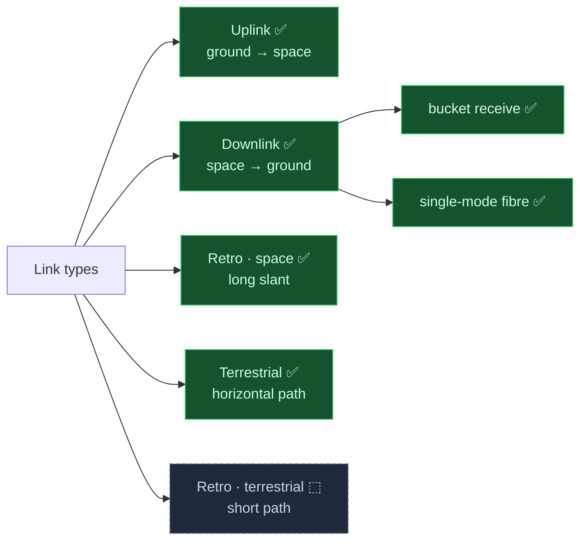
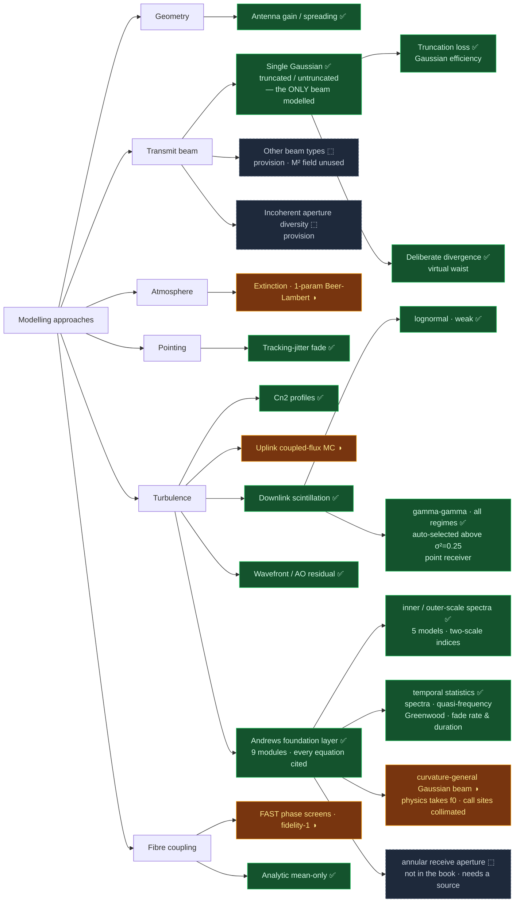
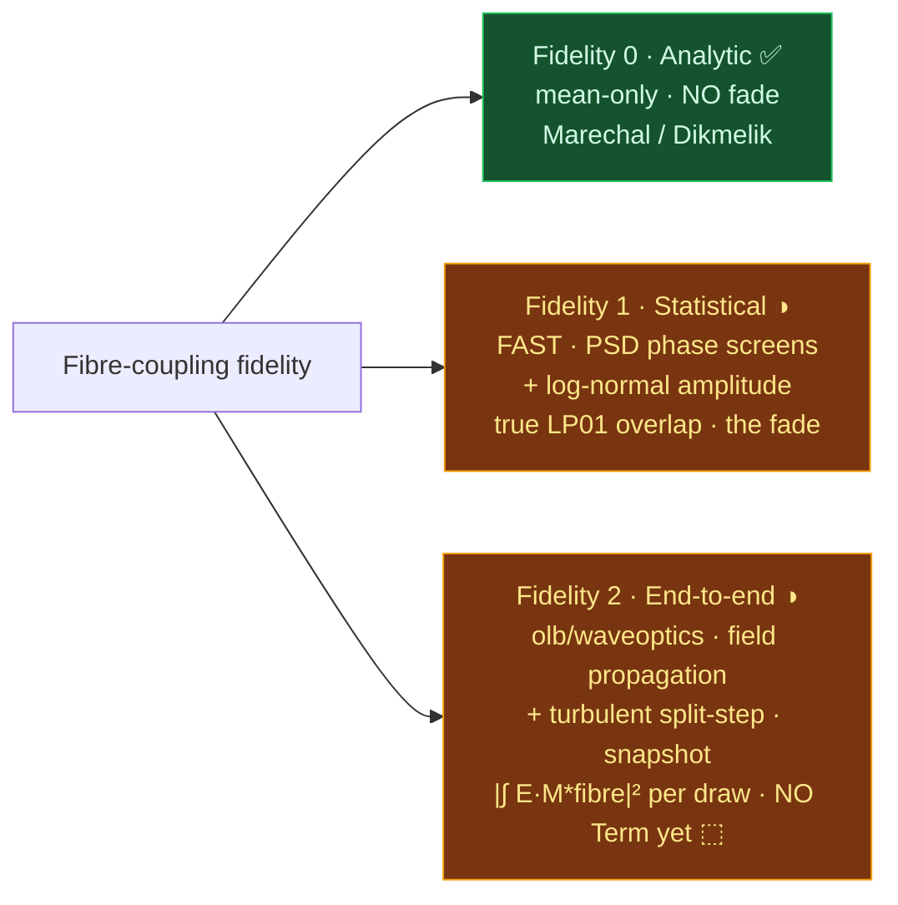
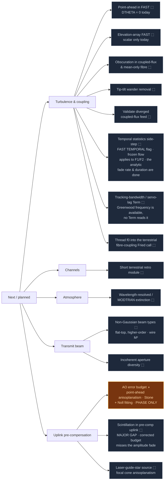

# optical_link_budget (olb)

Optical (laser) link budgets with atmospheric propagation, fade
statistics, and Monte Carlo. The package models uplink, downlink, and
retroreflected links (as well as terrestrial ones) at optical 
wavelengths (for example 1550 nm).

## Fidelity ladder

The organising idea of the package is a **fidelity ladder**: every budget is
built at one of three levels of rigour, chosen with a single `fidelity` argument
on each budget (`terrestrial_budget`, `downlink_budget`, `uplink_budget`).

- **Fidelity 0 — analytic.** A Term gives a closed-form loss. Cheap. It carries
  the most assumptions (far-field, weak fluctuation, flat wavefront).
- **Fidelity 1 — statistical.** A Term gives samples, so the budget gives a
  Monte-Carlo fade (FAST modal coupling, the coupled-flux uplink). Fewer
  assumptions, a real fade, still not a full field solve.
- **Fidelity 2 — wave optics.** A split-step field propagation. Assumption-free,
  and the most expensive. It appears as TWO Terms: a deterministic vacuum-optics
  Term (the full no-turbulence loss from launch to detector — truncation,
  geometric spread, aperture capture, vacuum fibre coupling) and a stochastic
  turbulence Term (the fade). Only the analytic extinction (molecular absorption)
  and pointing (mechanical jitter) Terms remain, because a vacuum-index field sim
  models neither.

Set `fidelity=0`, `1`, or `2` on each budget. **Fidelity 1 does not exist for a
terrestrial link** (FAST is a far-field plane-wave-source model; a near-field
finite Gaussian beam needs fidelity 2). Fidelity 2 needs a precomputed `wave`
bundle from `olb.models.coupling.run_fidelity2` — the budget never runs the
split-step propagation itself. See `examples/waveoptics/budget_wiring.py`.

## Dependency

This package reuses proven physics kernels from a sibling repository,
`my_analysis_modules`. `olb/_deps.py` is the only module that imports them.

- Set the environment variable `MY_ANALYSIS_MODULES` to the location of
  `my_analysis_modules`, or place it at `D:\repos\my_analysis_modules` (the
  default path).
- `fast-aosim` is optional (`pip install fast-aosim`). It supplies the
  Hufnagel-Valley HV57 Cn2 profile, and the fidelity-1 single-mode-fibre modal
  coupling (`downlink_budget(fidelity=1)`), the only statistical SMF coupling
  model (mean, quantile, and fade). Without it, pass an explicit `cn2_profile`,
  or use the built-in `default_cn2_profile` (which uses `get_c2n`), and use
  `fidelity=0` for the analytic mean-only coupling loss (no fade).
- `aotools` is optional (`pip install aotools`, or the `screens` extra). It draws
  the random phase screens of the fidelity-2 turbulent split-step layer,
  `olb.waveoptics.turbulence`. `olb` imports it and does not copy it, because
  `aotools` is LGPL-3.0. No budget needs it.

## Install

```
pip install -e .
```

## Quickstart

All hardware lives on a `Terminal`. A `SpaceScenario` pairs a `ground` and a
`space` terminal with a `Channel` (site plus orbit) and a `direction`; the
direction resolves which terminal transmits and which receives. A horizontal
ground-to-ground link is a `TerrestrialScenario` (a `near` and a `far` terminal
with a `TerrestrialChannel`) instead. Both expose the same tx/rx interface, so
the models are shared.

```python
import numpy as np
from olb import (SpaceScenario, Channel, Site, CircularOrbit,
                 Terminal, Transmitter, Aperture, uplink_budget)

# An uplink: a ground beam director launches to a satellite bucket receiver.
# The launch power sits on the Transmitter, the sensitivity on the Detector;
# the Budget reads them for the link margin.
ground_tx = Terminal(
    aperture_m=0.15, wavelength_m=1550e-9, pointing_jitter_rad=1e-6,
    transmitter=Transmitter(waist_m=0.06, power_dbm=30.0),   # 1 W launch
)
space_rx = Terminal(
    aperture_m=0.05, wavelength_m=1550e-9,
    detector=Aperture(sensitivity_dbm=-40.0),                # power-in-bucket
)
scenario = SpaceScenario(
    ground=ground_tx, space=space_rx, direction="uplink",
    channel=Channel(site=Site(cn2_ground=1.7e-14), altitude_m=600e3),
)

budget = uplink_budget(scenario, CircularOrbit(600e3, elevation_deg=60.0))
print(budget.to_frame())                 # itemised terms
print(budget.assumptions_frame())        # model constraints per term
print(budget.check())                    # flags a scenario that breaks an assumption

mc = budget.monte_carlo(20000, rng=np.random.default_rng(0), availabilities=(0.99,))
print(mc["margin_db"][0.99])             # 99 % link margin [dB]
```

For a bistatic station (different transmit and receive apertures), a downlink
into a single-mode fibre, the retroreflected link, and a terrestrial
horizontal-path link, see the runnable examples in `examples/`
(`build_a_link.py`, `retro_link.py`, `terrestrial_link.py`).

## Structure

The package uses one-way dependencies: `turbulence/` <- `models/` and `links/`.

- `olb/turbulence/` — pure physics (no scenario, no Term): Cn2 profiles,
  plane-wave (downlink) and beam-wave (uplink) scintillation indices, aperture
  averaging, the uplink coupled-flux Monte Carlo.
- `olb/models/` — Term factories: geometric spreading, atmospheric extinction
  (slant and horizontal), pointing jitter, receive coupling.
- `olb/links/` — per-direction Terms and budget assembly: `uplink_budget`,
  `downlink_budget`, `retro_budget`, `terrestrial_budget`.
- `olb/results.py` — `Term` (mean / analytic quantile / sampler) and `Budget`.
  Monte Carlo is not a separate path. The Budget asks each Term for samples.
- `olb/assumptions.py` — the model constraints (beam type, turbulence regime,
  spectrum) that each Term declares, and the check that flags a broken
  assumption.

## Roadmap

A living map of what the package models. Each section is a branching tree.
Update the leaves and their status as the code moves.

Legend: ✅ done · ◑ partial (works, with a listed gap) · ⬚ planned.

### Link types



### Modelling approaches



### Fidelity ladder — the fibre-coupling instance

This is the fibre-coupling instance of the general fidelity ladder above; set the
tier with `fidelity=0|1|2` on the budget. One `Terminal(SMF + AO(N))` drives any
tier; only the wavefront backing changes. The jump from 1 to 2 is real optical
propagation: FAST draws phase screens from power spectra and applies a log-normal
amplitude — it does NOT propagate a field. Monte Carlo is not unique to fibre
coupling: the uplink turbulence Term is its own Dios coupled-flux Monte Carlo
(beam wander + scintillation), sampled the same way — the Budget asks every Term
for samples.

Fidelity 2 is WIRED (`fidelity=2`, 2026-08-28). The `olb/waveoptics/` package
propagates a real complex field on a square grid, and `olb/waveoptics/turbulence/`
adds the turbulent split-step: aotools phase screens, snapshot statistics, seeded
repeatable trials. A space link always simulates the downlink slab; the uplink
number comes from the Shapiro reciprocity overlap. A fidelity-2 budget shows two
Terms: a deterministic vacuum-optics Term (the full no-turbulence loss, which also
validates the near-field and far-field limits of the analytic Terms) and a
stochastic turbulence Term. The caller precomputes both with
`olb.models.coupling.run_fidelity2`. The temporal mode and the rich results record
stay planned.

A **temporal** side-step runs across the fidelity tiers, not along them (planned,
NT6). Each statistical tier draws independent snapshots today, which give the
correct marginal fade depth but no time correlation. FAST has a `TEMPORAL` flag
that advects the phase screens with frozen-flow wind, so the same tier gives a
correlated time series and thus fade duration and fade rate. The temporal option
does NOT change the mean, the quantile, or the availability — those are marginal.



### Next / planned



## Documentation convention

All documentation uses ASD-STE100 Simplified Technical English. See
[CONVENTIONS.md](CONVENTIONS.md).
