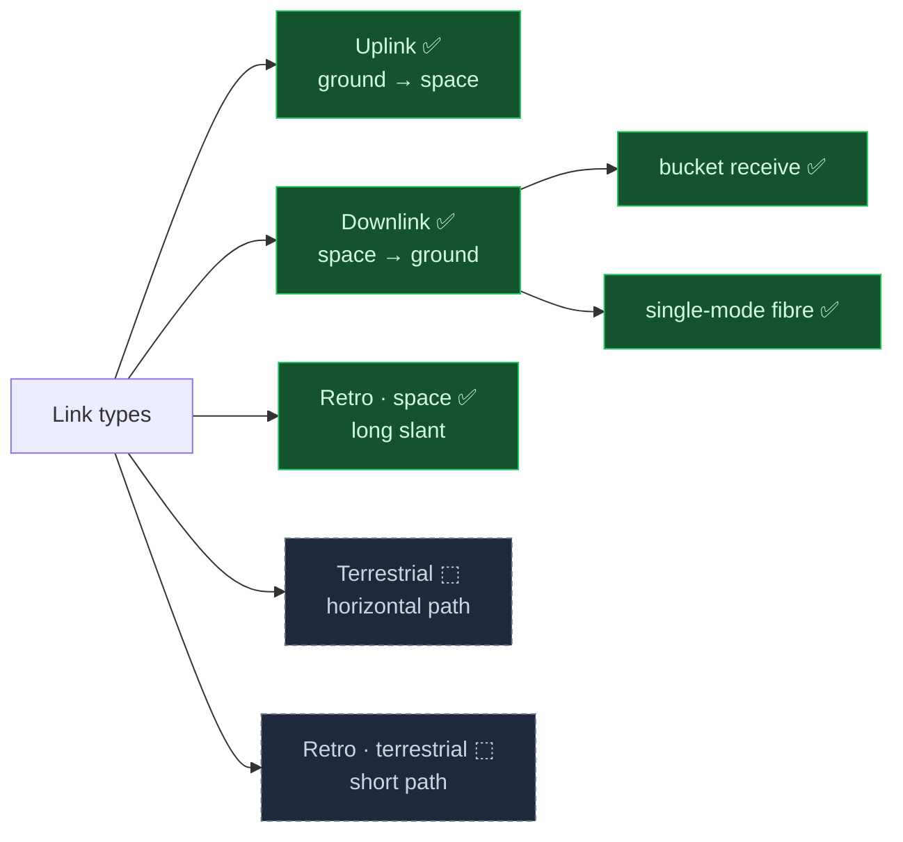
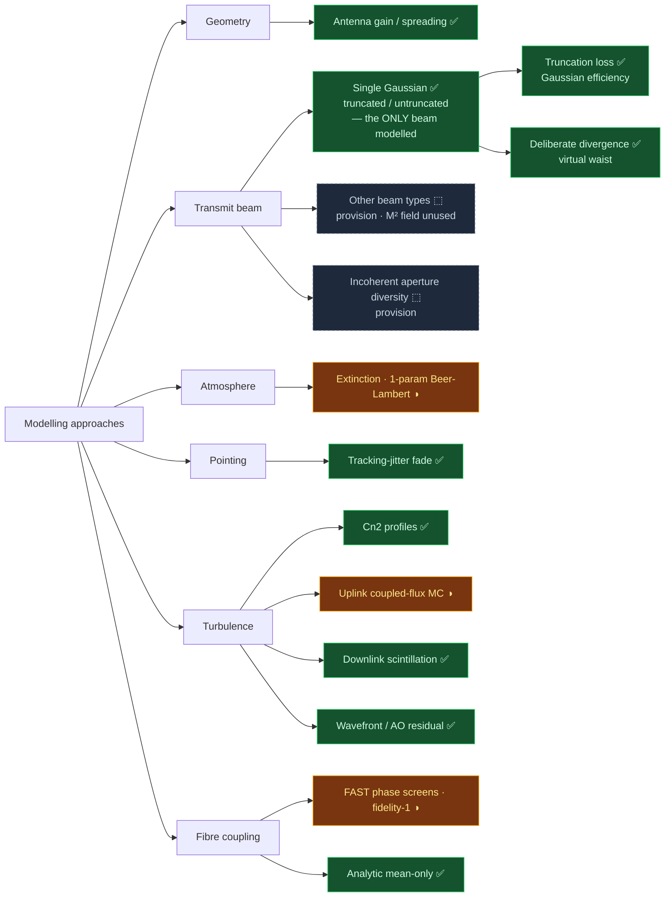
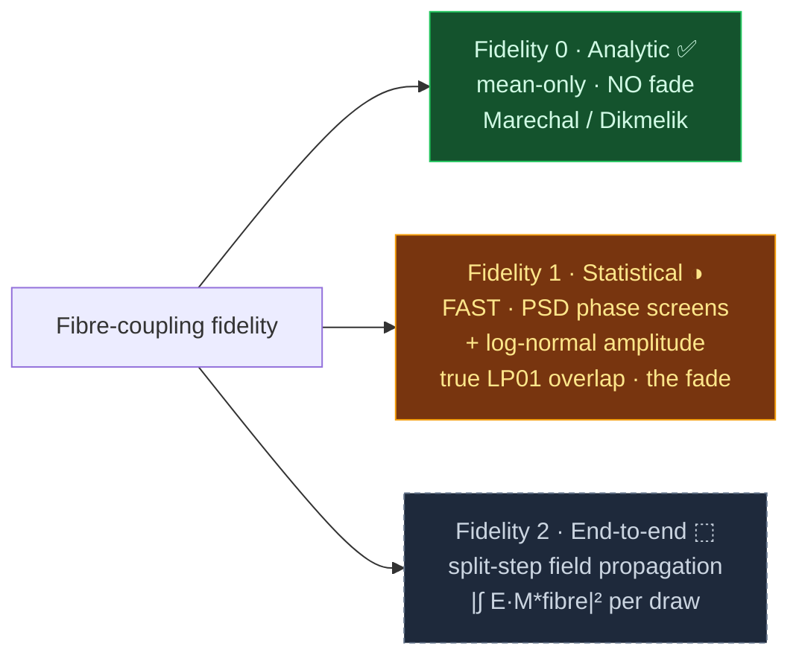
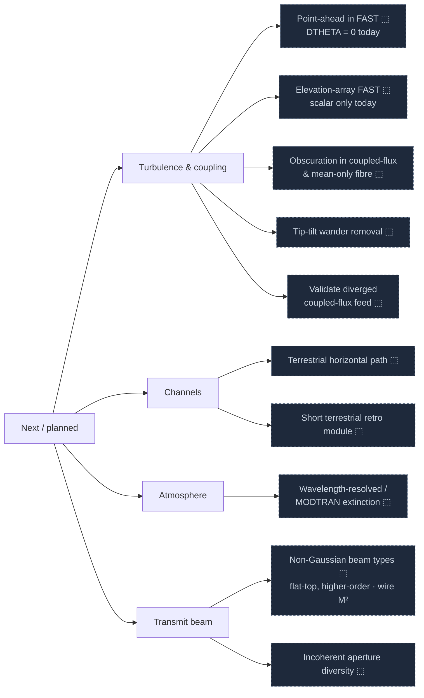

# optical_link_budget (olb)

Optical (laser) ground-to-space link budgets with atmospheric propagation, fade
statistics, and Monte Carlo. The package models uplink, downlink, and
retroreflected links at optical wavelengths (for example 1550 nm) to a LEO
satellite.

## Dependency

This package reuses proven physics kernels from a sibling repository,
`my_analysis_modules`. `olb/_deps.py` is the only module that imports them.

- Set the environment variable `MY_ANALYSIS_MODULES` to the location of
  `my_analysis_modules`, or place it at `D:\repos\my_analysis_modules` (the
  default path).
- `fast-aosim` is optional (`pip install fast-aosim`). It supplies the
  Hufnagel-Valley HV57 Cn2 profile, and the fidelity-1 single-mode-fibre modal
  coupling (the default `smf_fidelity="fast"`), which is the only statistical SMF
  coupling model (mean, quantile, and fade). Without it, pass an explicit
  `cn2_profile`, or use the built-in `default_cn2_profile` (which uses `get_c2n`),
  and use `smf_fidelity="mean"` for the analytic mean-only coupling loss (no fade).

## Install

```
pip install -e .
```

## Quickstart

All hardware lives on a `Terminal`. A `Scenario` pairs two terminals (`ground`,
`space`) with a `Channel` (the propagation channel: site plus orbit) and a
`direction`. The direction resolves which terminal transmits and which receives.

```python
import numpy as np
from olb import (Scenario, Channel, Site, CircularOrbit,
                 Terminal, Transmitter, Aperture, uplink_budget)

# An uplink: a ground beam director launches to a satellite bucket receiver.
# The launch power sits on the Transmitter, the sensitivity on the Detector;
# the Budget reads them for the link margin.
ground_tx = Terminal(
    aperture_m=0.15, wavelength_m=1550e-9, pointing_jitter_rad=1e-6,
    transmitter=Transmitter(waist_m=0.06, power_dbm=30.0),   # 1 W launch
)
space_rx = Terminal(
    aperture_m=0.05, wavelength_m=1550e-9,
    detector=Aperture(sensitivity_dbm=-40.0),                # power-in-bucket
)
scenario = Scenario(
    ground=ground_tx, space=space_rx, direction="uplink",
    channel=Channel(site=Site(cn2_ground=1.7e-14), altitude_m=600e3),
)

budget = uplink_budget(scenario, CircularOrbit(600e3, elevation_deg=60.0))
print(budget.to_frame())                 # itemised terms
print(budget.assumptions_frame())        # model constraints per term
print(budget.check())                    # flags a scenario that breaks an assumption

mc = budget.monte_carlo(20000, rng=np.random.default_rng(0), availabilities=(0.99,))
print(mc["margin_db"][0.99])             # 99 % link margin [dB]
```

For a bistatic station (different transmit and receive apertures), a downlink
into a single-mode fibre, and the retroreflected link, see the runnable
examples in `examples/` (`build_a_link.py`, `retro_link.py`).

## Structure

The package uses one-way dependencies: `turbulence/` <- `models/` and `links/`.

- `olb/turbulence/` — pure physics (no Scenario, no Term): Cn2 profiles,
  scintillation indices, aperture averaging, coupled-flux Monte Carlo.
- `olb/models/` — direction-agnostic Term factories: geometric spreading,
  atmospheric extinction, pointing jitter.
- `olb/links/` — per-direction Terms and budget assembly: `uplink_budget`,
  `downlink_budget`, `retro_budget`.
- `olb/results.py` — `Term` (mean / analytic quantile / sampler) and `Budget`.
  Monte Carlo is not a separate path. The Budget asks each Term for samples.
- `olb/assumptions.py` — the model constraints (beam type, turbulence regime,
  spectrum) that each Term declares, and the check that flags a broken
  assumption.

## Roadmap

A living map of what the package models. Each section is a branching tree.
Update the leaves and their status as the code moves.

Legend: ✅ done · ◑ partial (works, with a listed gap) · ⬚ planned.

### Link types



### Modelling approaches



### Fidelity ladder (fibre coupling)

One `Terminal(SMF + AO(N))` drives any tier; only the wavefront backing changes.
The jump from 1 to 2 is real optical propagation: FAST draws phase screens from
power spectra and applies a log-normal amplitude — it does NOT propagate a field.
This ladder is the downlink fibre coupling. Monte Carlo is not unique to it: the
uplink turbulence Term is its own Dios coupled-flux Monte Carlo (beam wander +
scintillation), sampled the same way — the Budget asks every Term for samples.



### Next / planned



## Documentation convention

All documentation uses ASD-STE100 Simplified Technical English. See
[CONVENTIONS.md](CONVENTIONS.md).
