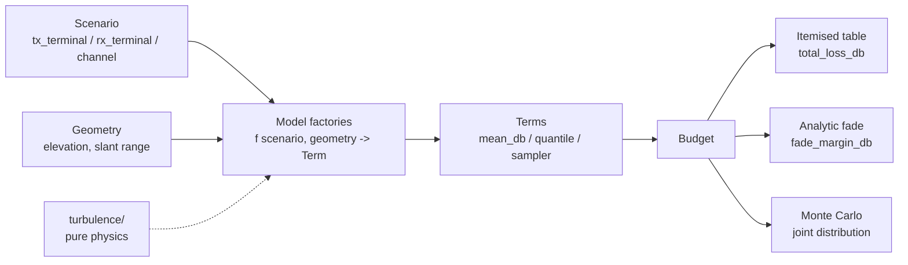

# Architecture of `olb` (optical_link_budget)

This is a reference document. It explains how the `olb` package builds optical
laser link budgets. The package models uplink, downlink, and retroreflected
links to a LEO satellite, plus horizontal ground-to-ground links. It adds
atmospheric propagation, fade statistics, and Monte Carlo.

Read `CLAUDE.md` for the authoritative architecture rules. This document
explains the design that the code carries.

## 1. Layers and the one-way dependency

The package has four layers. The data moves in one direction, from the inputs
to the result:

```
pure data   ->   models      ->   links       ->   results
(scenario)       (Terms from       (per-link         (Term, Budget)
(terminal)        scenario)         assembly)
```

Two helpers sit ABOVE the links. `olb/multidetector.py` builds one budget for
each detector behind a receive beamsplitter. `olb/sweep.py` builds one budget for
each elevation in a sweep. Each imports `olb.links`, `olb.models` and
`olb.terminal`, and nothing in `links/` or `models/` imports it back. See
Section 3.

The turbulence physics sits under the models and the links:

```
turbulence/   <-   models/  and  links/
```

The dependency is one-way. The `turbulence/` package is pure physics. It
imports only numpy, scipy, and the olb leaf modules `units` and `beam`. It does
NOT import a scenario, a terminal, a Term, the models, or the links. See
[`olb/turbulence/__init__.py`](../olb/turbulence/__init__.py).

This rule keeps the physics reusable and testable. A turbulence function takes
numeric arrays and returns numeric arrays. The models add the domain objects
around that physics. So the same scintillation integral serves the downlink
term and the terrestrial term, with no coupling between them.

The turbulence files are:
- [`profiles.py`](../olb/turbulence/profiles.py) — Cn2(h) profiles, `default_cn2_profile`, `DEFAULT_HS`.
- [`plane_wave_scintillation.py`](../olb/turbulence/plane_wave_scintillation.py) — plane-wave scintillation index and the aperture-averaging integral (the space-to-ground downlink model).
- [`gaussian_fried.py`](../olb/turbulence/gaussian_fried.py) — Gaussian-beam Fried parameter.
- [`beam_wave_scintillation.py`](../olb/turbulence/beam_wave_scintillation.py) — Dios Gaussian-beam scintillation index, on axis and off axis (the uplink beam-wave model).
- [`ao.py`](../olb/turbulence/ao.py) — plane-wave r0 and the Noll residual wavefront variance.
- [`angle_of_arrival.py`](../olb/turbulence/angle_of_arrival.py) — the received tip-tilt of a Gaussian beam. The beam-wander arrival tilt is the working model. The aperture angle-of-arrival tilt now delegates to `andrews.structure.angle_of_arrival_variance` (the gradient-tilt form, C-04).
- [`anisoplanatism.py`](../olb/turbulence/anisoplanatism.py) — Stone angular anisoplanatic phase variance, with the finite adaptive-optics band.
- [`uplink_flux.py`](../olb/turbulence/uplink_flux.py) — the LEO-uplink coupled-flux Monte Carlo wrapper.
- [`andrews/`](../olb/turbulence/andrews/) — the Andrews and Phillips foundation
  layer, nine modules: `aperture.py`, `beam.py`, `distributions.py`, `paths.py`,
  `scintillation.py`, `spectra.py`, `structure.py`, `temporal.py`, `wander.py`.
  Each function cites its chapter, equation number and printed page. The files
  above delegate to it and keep their own names. See
  [physics.md](physics.md) Section 5h.

### The wave-optics side layer

The [`waveoptics/`](../olb/waveoptics) package is the fidelity-2 field
propagation layer. Its core carries NO turbulence: it propagates a scalar complex
field through free space on a square grid. The turbulent split step is the
sub-package [`waveoptics/turbulence/`](../olb/waveoptics/turbulence), below. The
core is a trimmed port of LightPipes
(BSD-3-Clause, see
[`LIGHTPIPES_LICENSE.txt`](../olb/waveoptics/LIGHTPIPES_LICENSE.txt)), and it
keeps the LightPipes names and call order:

- `field.py` — `Field`, `Begin`, `Normal`, `Power`, `Intensity`, `Phase`, `SubIntensity`.
- `sources.py` — `GaussBeam`, `PlaneWave`, `CircAperture`, `CircScreen`.
- `propagators.py` — `Forvard`, `Fresnel`, `GForvard`. The three work on a flat grid only. Each one raises `ValueError` on a spherical field.
- `lenses.py` — `Lens`, `LensForvard`, `LensFresnel`, `Convert`. The thin lens, and the spherical (co-moving) coordinate route. `LensFresnel` moves the grid with the beam, so a beam that grows by a factor of 100 stays sampled on a small pixel count. `Convert` comes back to a flat grid.
- `smf.py` — the single-mode-fibre pupil mode and the overlap coupling efficiency.
- `mmf.py` — the multimode-fibre light-bucket coupling. `focal_intensity` focuses the pupil field to the detector plane `z = f + defocus_m` (a quadratic pupil phase), and `mmf_coupling_efficiency` sums the encircled energy inside the hard core disk on the axis.
- `camera.py` — the focal-plane array: `camera_image` bins the focused spot onto square camera pixels, and `spot_metrics` gives the centroid, the second-moment radius and the on-sensor power fraction (`SpotMetrics`). It reuses `mmf.focal_intensity`, so the focus, the defocus sign and the normalisation stay in one place. It is a DIAGNOSTIC layer: it builds no Term, and no budget reads it.
- `grid.py` — `GridSpec.for_scenario`, the automatic grid sizer with a manual override, `beam_magnification`, and `forvard_max_z`.
- `run.py` — `propagate_scenario(scenario, geometry, grid=None) -> WaveResult`, one end-to-end propagation.

The grid sizer selects the ROUTE, and the runner obeys it. `for_scenario` tries a
flat grid first, and it falls back to the scaled (co-moving) grid when the flat
grid cannot resolve the apertures. `GridSpec.scaled` records the choice.
`propagate_scenario` then runs one of three routes: the exact ABCD route
(`GForvard`) for an almost untouched Gaussian, the flat `Fresnel` convolution, or
the three-call lens recipe (`Lens`, `LensFresnel`, `Convert`) on a scaled grid.
The last one is the route for a long space link. See Schmidt,
DOI 10.1117/3.866274, Ch. 7.

The dependency stays one-way. The core (`field.py`, `sources.py`,
`propagators.py`, `lenses.py`, `smf.py`, `mmf.py`, `camera.py`) imports numpy and
scipy only, and it imports nothing from the rest of olb. Only `grid.py` and
`run.py` read a scenario.

The turbulent split-step layer now EXISTS at `olb/waveoptics/turbulence/`, and it
uses those same propagators. It holds `screens.py` (the random phase screens: the
DEFAULT fast `ScreenFactory`, a self-contained generator that imports numpy and
scipy only, plus the opt-in `aotools` reference path), `splitstep.py` (the
propagate-screen-propagate loop and the absorbing boundary mask), `sampling.py`
(the turbulent grid sizer and the screen-placement planner), `run.py`
(`propagate_turbulent_scenario`, one atmosphere snapshot for each seed, with the
`screen_generator="olb"` default and an optional `Threader`), `campaign.py` (a
large set of trials on disk, see below), `fingerprint.py` (the content key that
names one campaign), and `temporal.py` (the
frozen-flow time axis, PLANNED, NOT BUILT). The sub-package keeps the same import
tiers: `screens.py` and `splitstep.py` read the wave-optics core only,
`sampling.py`, `run.py` and `campaign.py` read the rest of olb (a scenario, the
Cn2 profiles, the Andrews layer), and `fingerprint.py` and `temporal.py` import
numpy only. A space
scenario always propagates the DOWNLINK slab; an uplink reads the same field
through the Shapiro reciprocity overlap, DOI 10.1364/JOSA.61.000492.

`propagate_turbulent_scenario` also takes an optional `detectors` sequence, the
arms behind a receive beamsplitter. Each trial then computes the coupling
efficiency of EVERY arm from the SAME clipped receive field, and it reports them
in the new `TurbTrial.detector_etas` tuple. So N arms cost ONE Monte Carlo, not
N. The default `detectors=None` leaves `detector_etas` None, so the
single-detector record is bit-identical. The shared field is exact, because a
beamsplitter multiplies the field of an arm by a constant and every coupling
efficiency is power-normalised (see Section 3).

The runner also takes `start_index` (the index of the FIRST trial, so a slice of
one seeded run computes alone and stays bit-identical) and `patch_radius_m` (the
radius of a receive-plane disc whose UNCLIPPED field each trial stores, as
`TurbWaveResult.fields` plus the `FieldPatch` in `TurbWaveResult.patch`; None
keeps the old, field-free record). The module functions `recouple` and
`recollect` read those stored fields back into a detector or an aperture, so a
smaller receive aperture, an obscuration, another detector or another defocus
costs no new propagation.

`campaign.py` builds on those two arguments. A `Campaign` names ONE physics case
(one scenario, one geometry, one grid, one screen plan, one seed) and it keeps
its trials on disk in fixed BLOCKS, one `.npz` for each block, plus a JSON
manifest that rebuilds the grid and the plan, so a resumed campaign never
re-sizes. The blocks are bit-identical slices of one native run, so a campaign
computes them in any order. `Campaign.run(n, workers=W)` opens ONE warm process
pool for the whole call and runs each block SERIALLY inside its process:
the parallelism lives at ONE level, because threads inside processes
over-subscribe the cores (`workers=None` keeps the serial-block, threaded-inside
route). `sizing_aperture_m` sizes the grid and the stored field patch one time
for the LARGEST receive aperture of a family, so every smaller aperture is a
post-hoc crop through `Campaign.recouple`/`recollect`. The dependency direction
holds: `campaign.py` reads `run.py`, the `cache_key` fingerprint of `fingerprint.py`,
`sampling.py`, `grid.py` and the `Threader`, and nothing in olb reads
`campaign.py` back.

Both parts are built and each module holds a self-check. The modules of this
package build no Term themselves, but their records ARE wired into the budgets
as `fidelity=2` (2026-08-28) through `olb.models.waveoptics` (`run_fidelity2`
plus the Term factories; see Section 5). The vacuum core is also the
no-turbulence validator for the near-field and far-field limits of the analytic
Terms. The open owner decision is whether fidelity 2 ever becomes a DEFAULT.
See [examples.md](examples.md) and
[examples/waveoptics/README.md](../examples/waveoptics/README.md).

For the full API, the propagator regimes, and the sampling limits, see
[api-waveoptics.md](api-waveoptics.md).

## 2. The pure-data layer

The pure-data layer holds the inputs. It computes no physics. It is the values
that you build, copy, change, and sweep.

### The Terminal owns all hardware

A [`Terminal`](../olb/terminal.py) is a plain dataclass. ALL terminal hardware
lives on a Terminal. A Terminal holds:
- `aperture_m`, `obscuration_ratio`, `wavelength_m`, `pointing_jitter_rad`;
- an optional `Transmitter` (`waist_m`, `power_dbm`, `m2`, `divergence_rad`, and an optional bistatic `aperture_m`);
- an optional `Detector` (an `Aperture` bucket, an `SMF` fibre, an `MMF` light bucket, or a `Camera` focal-plane array, each with a `sensitivity_dbm` and an optional beamsplitter `frac`; a fibre detector and a `Camera` also carry `defocus_m`, the detector offset from the design focus);
- an ordered `compensation` stack (`TipTilt`, `AO`).

A terminal parameter can only be set through a Terminal. One Terminal serves
both link directions. On an uplink the ground Terminal transmits. On a downlink
the roles swap. The Terminal does not import the models. The data moves one way.

A `Camera` holds `pixel_pitch_m`, `n_pixels`, `focal_length_m` and `defocus_m`.
It is a tracking and spot-diagnostic sensor, so NO budget builds a coupling Term
for it. `terrestrial_budget`, and `downlink_budget` at fidelity 2, treat a
`Camera` like an `Aperture` bucket. `downlink_budget` at fidelity 0 or 1 raises,
because `models/coupling/downlink.py` knows an `Aperture` and an `SMF` only. The
focal-plane tools are `olb/waveoptics/camera.py`.

A Terminal holds ONE detector, and about twenty detector dispatch sites read
that one field. A receive path that feeds SEVERAL detectors keeps that rule: each
detector carries its power fraction `frac`, and the helper `olb/multidetector.py`
makes one Terminal, and one budget, for each arm. See Section 3.

### Two scenario families, one interface

A link case is a [`SpaceScenario`](../olb/scenario.py) or a
[`TerrestrialScenario`](../olb/scenario.py). Each family names its two
terminals for what they physically are:

| Family | Terminals | Channel |
| --- | --- | --- |
| `SpaceScenario` | `ground`, `space` | `Channel` (site + orbit `altitude_m`) |
| `TerrestrialScenario` | `near`, `far` | `TerrestrialChannel` (site + path + Cn2) |

Both families expose the SAME thin interface that the models read:

```
scenario.tx_terminal   the transmit terminal
scenario.rx_terminal   the receive terminal
scenario.channel       the propagation channel
```

So no model changes between the two families. A `SpaceScenario` resolves the
two roles from its `direction`:

| direction | tx_terminal | rx_terminal |
| --- | --- | --- |
| uplink | ground | space |
| downlink | space | ground |
| retro | ground | ground |

A `TerrestrialScenario` has its own `direction`, because a horizontal path is
reciprocal: `"forward"` (the default) gives tx = near, rx = far, and
`"reverse"` swaps the two. The channel does not change. That direction is a
DIFFERENT type from the space `direction`, because "terrestrial" is a channel
family, not a tx/rx geometry.

A `SpaceScenario` also carries an optional `precompensation` source for the
uplink: a `DownlinkBeacon`, a `LaserGuideStar` (a placeholder), or None. The
source names what the ground terminal senses to build the uplink correction.
The uplink budget reads it and selects the turbulence physics from it. It
applies to the uplink direction only.

### The channel holds no hardware

A `Channel` or a `TerrestrialChannel` is the propagation medium. It holds a
`Site` (location and atmosphere) and the path (orbit altitude, or horizontal
path length and extinction and Cn2). A channel holds NO terminal hardware. The
separation is strict: hardware on the Terminal, medium on the channel.

## 3. The model layer

The [`models/`](../olb/models) package holds the Term factories. Each factory is
named for the physics it computes. Some use a link-specific simplification, and
the name says so. Every public factory has the same shape, so the budget
assembler calls them uniformly:

```
def <term>(scenario, geometry, **kwargs) -> Term
```

A model reads only the scenario and the geometry. It does not import another
model or the budget. See [`olb/models/__init__.py`](../olb/models/__init__.py).

The geometry gives two arrays: `elevation_deg` and `slant_range_m`. The backend
is a `CircularOrbit` (analytic, vectorised, for sweeps and Monte Carlo) or a
`TLEPass` (a real pass with skyfield). The backend does not change the models.

The model files are:
- [`geometric.py`](../olb/models/geometric.py) — free-space spreading loss into a circular aperture.
- [`extinction.py`](../olb/models/extinction.py) — `slant_extinction_term` (slant airmass extinction) AND `terrestrial_extinction_term` (horizontal Beer-Lambert extinction).
- [`pointing.py`](../olb/models/pointing.py) — pointing-jitter fade.
- [`gaussian_efficiency.py`](../olb/models/gaussian_efficiency.py) — transmit truncation loss at the launch aperture.
- [`splitter.py`](../olb/models/splitter.py) — the receive beamsplitter. `resolve_fracs(detectors)` turns the `frac` field of a set of detectors into one fraction for each arm; at most ONE detector may leave `frac` at None, and that arm takes the remainder (a lone None takes 1.0). The given fractions must not add up to more than 1.0, and a sum below 1.0 is the excess loss of the splitter. A violation raises `ValueError`. `splitter_term(frac)` gives the fixed `-10*log10(frac)` dB Term, of category `"system"`. `arm_scenario(scenario, detector)` copies a scenario with that detector on the receive terminal; it resolves the correct terminal field for each family and direction (a downlink and a retro on `ground`, an uplink on `space`, a forward terrestrial on `far`, a reverse one on `near`).
- [`coupling/`](../olb/models/coupling) — the receive-coupling Terms, split by link. `_common.py` holds the shared SMF physics, which is the flat-wavefront `smf_eta_max_from_a(a)` and the defocus-aberrated `smf_eta_defocused(a, c)`. `downlink.py` holds the downlink SMF and aperture coupling. `terrestrial.py` holds the terrestrial SMF and MMF coupling with the tip-tilt walk-off fade, and the public `curvature_focus_shift(scenario)`. `fast.py` holds the FAST fibre coupling and `uplink_fast_term`, the fidelity-1 pre-compensated uplink Term.

The terrestrial coupling Terms ALWAYS charge the received-beam curvature. A
terrestrial received beam is a diverging Gaussian, so the true focus of the
coupling optic sits BEYOND its focal plane, and the Terms evaluate the detector
at `dz_eff = defocus_m - dz_curv`. `optimal_focus` stays a focal-LENGTH rule and
never moves the detector. See `docs/physics.md` section 6a.

The [`links/`](../olb/links) package assembles the per-link budget. It composes
the model factories and the turbulence physics: [`uplink.py`](../olb/links/uplink.py),
[`downlink.py`](../olb/links/downlink.py), [`retro_space.py`](../olb/links/retro_space.py),
and [`terrestrial.py`](../olb/links/terrestrial.py).
[`bidirectional.py`](../olb/links/bidirectional.py) is a thin wrapper on the
terrestrial budget: one monostatic collimator defocus `dz` drives BOTH the
transmit divergence and the receive coupling, and the wrapper returns the forward
and the reverse budget of one horizontal path.

### Several detectors behind one beamsplitter

[`olb/multidetector.py`](../olb/multidetector.py) holds
`multi_detector_budgets(scenario, geometry, detectors, wave=None, **kwargs)`. It
gives one `(detector, Budget)` pair for each arm, in the `detectors` order. For
each arm it copies the scenario with `arm_scenario`, it calls the budget
function of the scenario family and direction, and it adds the fixed
`splitter_term`. An arm that takes all the power (a fraction of 1.0) gets no
splitter row. The input scenario does not change, and a per-arm error is not
caught. `olb/__init__.py` exports the function.

The split is CROSS-CUTTING: it is not the physics of one link. So the module
sits ABOVE `links/` in the dependency order.

The shared field is EXACT. A beamsplitter multiplies the field of an arm by a
constant, so the arm keeps the SHAPE of the received field and it loses only
power. Every coupling efficiency in olb is power-normalised, so the split ratio
does not change it. The ratio therefore enters the budget one time, as the fixed
dB Term. Source: Saleh and Teich, Fundamentals of Photonics,
DOI 10.1002/0471213748.

At fidelity 2 the arms share ONE Monte Carlo.
`olb.models.waveoptics.run_fidelity2(scenario, geometry, detectors=[...])`
returns a LIST of `Fidelity2Bundle`, one for each arm, from one turbulent run:
each bundle re-keys that arm's `TurbTrial.detector_etas` value onto the Term
face of its detector type, and each arm gets its own deterministic vacuum
baseline. Pass that list as `wave`. A `wave` list of the wrong length raises.

### An elevation sweep

[`olb/sweep.py`](../olb/sweep.py) holds
`budgets_vs_elevation(scenario, elevations, *, geometry_factory=None, **kwargs)`.
It gives one `(elevation_deg, Budget)` pair for each angle, in the `elevations`
order. For each angle it builds a scalar-elevation `CircularOrbit` from
`scenario.channel.altitude_m` (or from an optional `geometry_factory`), and it
calls the budget function of the scenario family and direction (it reuses
`multidetector._budget_function`). It passes `**kwargs` to the budget unchanged,
and a per-angle error is not caught. `olb/__init__.py` exports the function.

The sweep exists because some Terms model ONE line of sight and refuse an
elevation ARRAY: the FAST coupling Term runs one Monte Carlo for one geometry,
and the gamma-gamma downlink Term carries one `(alpha, beta)` pair. So the
correct answer is a loop, not a vectorised call. A `SpaceScenario` has the
elevation axis; a `TerrestrialScenario` has none, so it raises. Like
`multidetector.py`, the sweep is CROSS-CUTTING and sits ABOVE `links/`.

## 4. The result layer

### A Term has three faces

A [`Term`](../olb/results.py) is one line of the link budget. It gives three
views of the same contribution. The choice of analytic or Monte Carlo is the
choice of view:

- `term.mean_db` — the deterministic value, or the expected loss. Loss is positive dB; gain is negative dB.
- `term.quantile_db(p)` — the analytic loss at availability `p`, if a closed form exists. It returns `None` for a term that has only samples.
- `term.sample_db(n, rng)` — `n` Monte Carlo draws of the contribution.

A deterministic term, such as geometric loss, sets only `mean_db`. The budget
broadcasts it into samples and uses a constant quantile. A statistical term
with a closed form, such as the log-normal scintillation, gives a quantile and
a sampler. A term with only a Monte Carlo model, such as the coupled-flux beam
wander and scintillation, gives only a sampler, and `quantile_db` returns
`None`. That `None` tells the budget to use Monte Carlo, not the analytic sum.

### The Budget asks each Term for samples

A [`Budget`](../olb/results.py) is a list of Terms with the optional top-line
values (tx power, rx sensitivity). It reports four views:
- `total_loss_db()` — the deterministic total.
- `to_frame()` — the itemised table, one row per Term.
- `fade_margin_db(p)` — the analytic fade, the sum of the per-term p-quantile losses.
- `monte_carlo(n)` — the full joint distribution.

Monte Carlo is NOT a separate path. The Budget asks each Term for samples, not
means. `monte_carlo()` samples every term with the same rng and sums the
samples per draw. This keeps the correlations inside a term (for example the
coupled-flux wander and scintillation). Independent terms combine correctly by
construction.

## 5. The assumptions mechanism

Each model is valid only in a regime. A Term carries an
[`Assumptions`](../olb/assumptions.py) record that states three headline axes:
- `beam_type` — plane wave, spherical wave, or Gaussian beam.
- `turbulence_regime` — weak, moderate, or strong, tied to a bound on the scintillation index.
- `spectrum` — the turbulence spectrum, for example Kolmogorov with no inner or outer scale.

`Budget.check()` collects the `violations` of every Term and warns for each one.
It also flags a budget that MIXES turbulence spectra, because the terms model the
same atmosphere and must assume one spectrum.
`Budget.assumptions_frame()` prints the regime table, one row per Term.

### The assumption belongs to the function

A physics function OWNS its assumptions. The `@assumes(...)` decorator (in
`olb/assumptions.py`) attaches a machine-readable `FuncAssumptions` record and
optional `Constraint` runtime checks to the function. The scope is the physics
layer: `olb/turbulence/**` plus the Term factories in `olb/links/` and
`olb/models/`. (`olb/waveoptics/` waits; its numerical-sampling assumptions are a
different family.)

- A `Constraint` is a frozen record: a `kind` slug (one of ~21 axes, for example
  `regime`, `zenith`, `tracking`, `tilt-convention`, `conflict`), one ASD-STE100
  `statement`, the source `doi`, the printed `where`, and an optional
  `check(args, result) -> Optional[str]`. A check returns one ASD-STE100 reason
  string when the scenario breaks the limit, or `None`. A check NEVER warns and
  NEVER raises; warnings stay factory-level.
- A shared constraint is defined ONCE as a module-level `Constraint` and passed
  to each `@assumes(...)` that carries it. `module_assumptions(...)` is optional
  sugar for a statement true of EVERY public function in a file.

A Term factory opens `with trace_assumptions() as trace:` around its physics
calls. Every decorated function that runs registers its source and any check
violation to the trace, so the Term inherits the union automatically through
`trace.merge(beam_type=..., turbulence_regime=..., spectrum=..., validity=...)`.
A forgotten physics dependency becomes impossible. `merge_assumptions(*records)`
recomposes finished Terms (the retro link folds the uplink and downlink records).
Outside a context the decorator does ONE `ContextVar` read and calls the
function, so the numeric output is byte-identical. A `ContextVar` is thread-local:
a worker thread does not inherit the caller's context (the untraced guard below is
the net).

The `Assumptions` record gained `constraints` (the traced `(source, Constraint)`
pairs) and `provenance` (the traced physics source names); `flag(reason,
source=...)` tags a scenario-level fact the physics never sees (a central
obscuration, the extended-Marechal limit, NO SCINTILLATION) with the same
`[source]` prefix. `results.py` adds a `provenance` column and an `n_constraints`
column to `assumptions_frame()`, a new `constraints_frame()` (one row per Term
and constraint), and an untraced-Term guard in `Budget.check()`: a `turbulence`
or `coupling` Term with empty `provenance` is reported, because the factory did
not open the collection context. A legitimately untraced Term self-declares
`provenance=["untraced: ..."]` (the wave-optics simulation, the external FAST
part) to pass the guard.

### Newly enforced constraints, and the open follow-ups

The refactor turns prose-only limits into runtime checks. Some checks now flip
`ok` to not-ok in cases that previously read ok, and this is the INTENDED effect
(the point is to catch a missed flag), NOT a regression. Two checks flip a
CURRENT default budget, because the wired factories trace the feeders that carry
them:

- the Gaussian second weak condition (a focused beam, `sigma_R^2 * Lambda^(5/6)`);
- the extended-Marechal limit (a strong adaptive-optics residual).

One check is enforced but LATENT. The FIRST zenith enforcement
(`ZENITH_CONSTRAINT` on the `andrews/paths.py` slant functions) is real, but it
does NOT flip a current budget: the production downlink and uplink factories do
NOT trace `andrews.paths`. They trace the parallel feeders
`plane_wave_scintillation.plane_wave_scintillation_index` and
`uplink_flux._flux_result`, which carry their OWN regime checks (a local
`_sec_zeta`, no zenith gate). So the zenith flag fires only when a future factory
is wired to the `andrews.paths` slant integrators (or in the paths.py
self-check). It is a latent guard, not a live budget-flipper today.

One status item stays open and honest, and two are now closed:

- The 0.25 house rule has ONE canonical definition,
  `LOGNORMAL_PDF_LIMIT = 0.25` in `andrews/scintillation.py`. The old name
  `WEAK_FLUCTUATION_LIMIT` is fully retired: no source file references it. The
  PDF-shape axis (`sigma2_I`) and the regime axis (`sigma2_R`) stay separate.
- CLOSED (2026-09-04). The terrestrial SMF walk-off weak-limit gap is now a
  FUNCTION-OWNED check. `coupled_flux.beam_wander_variance` takes an optional
  `wavelength`; give it and the kernel runs the shared beam-aware `rytov_weak`
  gate and returns the violation itself. `angle_of_arrival`
  `wander_arrival_angle_variance` passes the keyword on, and the terrestrial
  factory gives `rx.wavelength_m`, so the Term inherits the violation through
  the trace. The old factory patch is deleted. The value never changes: with no
  wavelength the check does not run. The MMF coupling Term reads the same wander
  model and asks for the check too (owner decision, 2026-09-04), so a strong
  path flags the MMF Term where it was silent before.
- CLOSED (2026-09-04). `MARECHAL_SIGMA2_MAX = 1.0` has ONE home,
  `olb/turbulence/ao.py`. `olb/links/uplink.py` imports it from there (the
  one-way `turbulence <- links` dependency allows a link module to import down).

### The fidelity ladder and the fidelity-0 fade lock

Every budget takes one whole-path `fidelity=0|1|2` argument (see the README
fidelity ladder). Fidelity 0 is analytic, fidelity 1 is statistical (a real
fade), and fidelity 2 is wave optics (two Terms: a deterministic vacuum-optics
Term and a stochastic turbulence Term, from a precomputed `wave` bundle).

Every budget also takes a master `turbulence` switch, at EVERY rung. When it is
False the budget drops each turbulence quantity and it keeps the deterministic
Terms. At fidelity 2 that means no wave-optics turbulence Term and no stochastic
coupling Term. Pair it with `run_fidelity2(turbulence=False)`, which makes NO
screens and NO trials and gives a vacuum-only bundle
(`Fidelity2Bundle.turbulent` is None). A space link then needs no run at all: its
EMPTY bundle (`vacuum=None`, `turbulent=None`) is valid, because the geometric
loss is analytic. A terrestrial link still sizes the SAME turbulent grid and
propagates the vacuum field on it, so the vacuum Term does not move when the
caller toggles the switch. A terrestrial or downlink MMF receiver keeps ONE
deterministic core-capture Term, `waveoptics_vacuum_mmf_term`. A `wave` bundle
stays REQUIRED at fidelity 2, so the call shape is uniform, and a vacuum-only
bundle with `turbulence=True` raises.

A Term can set `mean_only=True`. This marks a fidelity-0 model. Such a Term
gives the expected loss of a quantity that really fluctuates (for example a
fibre-coupling loss from the mean residual wavefront). It carries no
trustworthy fade.

A mean-only Term locks the whole budget out of fade results.
`Budget.provides_fade` is False when any Term is mean-only.
`fade_margin_db()` then raises a `ValueError`. `monte_carlo()` reports the mean,
but it suppresses the fade and the margin and warns. This stops a misleading
tail, where the budget would add the other terms' fades to a coupling mean. To
get the coupling fade, raise the fidelity: `fidelity=1` (statistical) or
`fidelity=2` (wave optics). Note a deterministic Term (a sampler-less,
quantile-less vacuum-optics Term) is NOT mean_only, so it does not lock the
budget.

## 6. Self-contained: the vendored physics (formerly `my_analysis_modules`)

olb no longer depends on `my_analysis_modules`. It once borrowed shared physics
kernels from that sibling repo through a single seam, `olb/_deps.py`. Those
kernels are now VENDORED into olb, each in its natural home:

- the dB and beam unit conversions -> [`olb/units.py`](../olb/units.py);
- the Gaussian-beam `gaussz`/`zR` -> [`olb/beam.py`](../olb/beam.py);
- the `Satellite`/`SatellitePass` geometry -> [`olb/geometry.py`](../olb/geometry.py);
- the Hufnagel-Valley Cn2 (`get_c2n`) and the Bufton wind (`v_wind`) ->
  [`olb/turbulence/profiles.py`](../olb/turbulence/profiles.py);
- the Dios coupled-flux kernels ->
  [`olb/turbulence/coupled_flux.py`](../olb/turbulence/coupled_flux.py).

`_deps.py` is deleted. Each vendored copy is verbatim and keeps its source
citation; the coupled-flux vendoring was cross-validated bit-for-bit against the
original. The `fast` package (FAST fibre coupling / HV57 Cn2) and `aotools` (the
fidelity-2 phase screens) stay optional third-party dependencies that the
relevant modules import lazily.

## Data-flow diagram



The scenario and the geometry feed the model factories. The factories return
Terms. The Budget collects the Terms. It reports the table, the analytic fade,
or the Monte Carlo. The turbulence physics feeds the model factories, but it
never depends on them.
