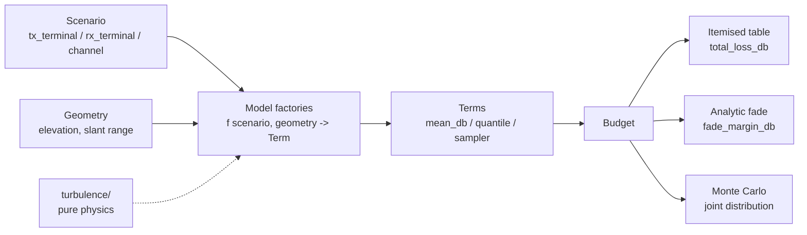

# Architecture of `olb` (optical_link_budget)

This is a reference document. It explains how the `olb` package builds optical
laser link budgets. The package models uplink, downlink, and retroreflected
links to a LEO satellite, plus horizontal ground-to-ground links. It adds
atmospheric propagation, fade statistics, and Monte Carlo.

Read `CLAUDE.md` for the authoritative architecture rules. This document
explains the design that the code carries.

## 1. Layers and the one-way dependency

The package has four layers. The data moves in one direction, from the inputs
to the result:

```
pure data   ->   models      ->   links       ->   results
(scenario)       (Terms from       (per-link         (Term, Budget)
(terminal)        scenario)         assembly)
```

The turbulence physics sits under the models and the links:

```
turbulence/   <-   models/  and  links/
```

The dependency is one-way. The `turbulence/` package is pure physics. It
imports only numpy, scipy, and [`_deps.py`](../olb/_deps.py). It does NOT
import a scenario, a terminal, a Term, the models, or the links. See
[`olb/turbulence/__init__.py`](../olb/turbulence/__init__.py).

This rule keeps the physics reusable and testable. A turbulence function takes
numeric arrays and returns numeric arrays. The models add the domain objects
around that physics. So the same scintillation integral serves the downlink
term and the terrestrial term, with no coupling between them.

The turbulence files are:
- [`profiles.py`](../olb/turbulence/profiles.py) — Cn2(h) profiles, `default_cn2_profile`, `DEFAULT_HS`.
- [`plane_wave_scintillation.py`](../olb/turbulence/plane_wave_scintillation.py) — plane-wave scintillation index and the aperture-averaging integral (the space-to-ground downlink model).
- [`gaussian_fried.py`](../olb/turbulence/gaussian_fried.py) — Gaussian-beam Fried parameter.
- [`beam_wave_scintillation.py`](../olb/turbulence/beam_wave_scintillation.py) — Dios Gaussian-beam scintillation index, on axis and off axis (the uplink beam-wave model).
- [`ao.py`](../olb/turbulence/ao.py) — plane-wave r0 and the Noll residual wavefront variance.
- [`angle_of_arrival.py`](../olb/turbulence/angle_of_arrival.py) — the received tip-tilt of a Gaussian beam. The beam-wander arrival tilt is the working model. The aperture angle-of-arrival tilt is a deferred stub.
- [`anisoplanatism.py`](../olb/turbulence/anisoplanatism.py) — Stone angular anisoplanatic phase variance, with the finite adaptive-optics band.
- [`uplink_flux.py`](../olb/turbulence/uplink_flux.py) — the LEO-uplink coupled-flux Monte Carlo wrapper.
- [`andrews/`](../olb/turbulence/andrews/) — the Andrews and Phillips foundation
  layer, nine modules: `aperture.py`, `beam.py`, `distributions.py`, `paths.py`,
  `scintillation.py`, `spectra.py`, `structure.py`, `temporal.py`, `wander.py`.
  Each function cites its chapter, equation number and printed page. The files
  above delegate to it and keep their own names. See
  [physics.md](physics.md) Section 5h.

### The wave-optics side layer

The [`waveoptics/`](../olb/waveoptics) package is the fidelity-2 field
propagation layer. Its core carries NO turbulence: it propagates a scalar complex
field through free space on a square grid. The turbulent split step is the
sub-package [`waveoptics/turbulence/`](../olb/waveoptics/turbulence), below. The
core is a trimmed port of LightPipes
(BSD-3-Clause, see
[`LIGHTPIPES_LICENSE.txt`](../olb/waveoptics/LIGHTPIPES_LICENSE.txt)), and it
keeps the LightPipes names and call order:

- `field.py` — `Field`, `Begin`, `Normal`, `Power`, `Intensity`, `Phase`, `SubIntensity`.
- `sources.py` — `GaussBeam`, `PlaneWave`, `CircAperture`, `CircScreen`.
- `propagators.py` — `Forvard`, `Fresnel`, `GForvard`. The three work on a flat grid only. Each one raises `ValueError` on a spherical field.
- `lenses.py` — `Lens`, `LensForvard`, `LensFresnel`, `Convert`. The thin lens, and the spherical (co-moving) coordinate route. `LensFresnel` moves the grid with the beam, so a beam that grows by a factor of 100 stays sampled on a small pixel count. `Convert` comes back to a flat grid.
- `smf.py` — the single-mode-fibre pupil mode and the overlap coupling efficiency.
- `grid.py` — `GridSpec.for_scenario`, the automatic grid sizer with a manual override, `beam_magnification`, and `forvard_max_z`.
- `run.py` — `propagate_scenario(scenario, geometry, grid=None) -> WaveResult`, one end-to-end propagation.

The grid sizer selects the ROUTE, and the runner obeys it. `for_scenario` tries a
flat grid first, and it falls back to the scaled (co-moving) grid when the flat
grid cannot resolve the apertures. `GridSpec.scaled` records the choice.
`propagate_scenario` then runs one of three routes: the exact ABCD route
(`GForvard`) for an almost untouched Gaussian, the flat `Fresnel` convolution, or
the three-call lens recipe (`Lens`, `LensFresnel`, `Convert`) on a scaled grid.
The last one is the route for a long space link. See Schmidt,
DOI 10.1117/3.866274, Ch. 7.

The dependency stays one-way. The core (`field.py`, `sources.py`,
`propagators.py`, `lenses.py`, `smf.py`) imports numpy and scipy only, and it
imports nothing from the rest of olb. Only `grid.py` and `run.py` read a
scenario.

The turbulent split-step layer now EXISTS at `olb/waveoptics/turbulence/`, and it
uses those same propagators. It holds `screens.py` (the random phase screens,
from `aotools`), `splitstep.py` (the propagate-screen-propagate loop and the
absorbing boundary mask), `sampling.py` (the turbulent grid sizer and the
screen-placement planner), `run.py` (`propagate_turbulent_scenario`, one
atmosphere snapshot for each seed), and `temporal.py` (the frozen-flow time axis,
PLANNED, NOT BUILT). The sub-package keeps the same import tiers: `screens.py`
and `splitstep.py` read the wave-optics core only, `sampling.py` and `run.py`
read the rest of olb (a scenario, the Cn2 profiles, the Andrews layer), and
`temporal.py` imports numpy only. A space scenario always propagates the DOWNLINK
slab; an uplink reads the same field through the Shapiro reciprocity overlap,
DOI 10.1364/JOSA.61.000492.

Both parts are built and each module holds a self-check, but neither builds a
Term and neither changes a budget. The vacuum core is the no-turbulence validator
for the near-field and far-field limits of the analytic Terms. A fidelity-2 Term
is an owner-gated later step. See [examples.md](examples.md) and
[examples/waveoptics/README.md](../examples/waveoptics/README.md).

For the full API, the propagator regimes, and the sampling limits, see
[api-waveoptics.md](api-waveoptics.md).

## 2. The pure-data layer

The pure-data layer holds the inputs. It computes no physics. It is the values
that you build, copy, change, and sweep.

### The Terminal owns all hardware

A [`Terminal`](../olb/terminal.py) is a plain dataclass. ALL terminal hardware
lives on a Terminal. A Terminal holds:
- `aperture_m`, `obscuration_ratio`, `wavelength_m`, `pointing_jitter_rad`;
- an optional `Transmitter` (`waist_m`, `power_dbm`, `m2`, `divergence_rad`, and an optional bistatic `aperture_m`);
- an optional `Detector` (an `Aperture` bucket or an `SMF` fibre, each with a `sensitivity_dbm`);
- an ordered `compensation` stack (`TipTilt`, `AO`).

A terminal parameter can only be set through a Terminal. One Terminal serves
both link directions. On an uplink the ground Terminal transmits. On a downlink
the roles swap. The Terminal does not import the models. The data moves one way.

### Two scenario families, one interface

A link case is a [`SpaceScenario`](../olb/scenario.py) or a
[`TerrestrialScenario`](../olb/scenario.py). Each family names its two
terminals for what they physically are:

| Family | Terminals | Channel |
| --- | --- | --- |
| `SpaceScenario` | `ground`, `space` | `Channel` (site + orbit `altitude_m`) |
| `TerrestrialScenario` | `near`, `far` | `TerrestrialChannel` (site + path + Cn2) |

Both families expose the SAME thin interface that the models read:

```
scenario.tx_terminal   the transmit terminal
scenario.rx_terminal   the receive terminal
scenario.channel       the propagation channel
```

So no model changes between the two families. A `SpaceScenario` resolves the
two roles from its `direction`:

| direction | tx_terminal | rx_terminal |
| --- | --- | --- |
| uplink | ground | space |
| downlink | space | ground |
| retro | ground | ground |

A `TerrestrialScenario` is one-way along the path: tx = near, rx = far. It has
NO `direction`, because "terrestrial" is a channel family, not a tx/rx
geometry.

A `SpaceScenario` also carries an optional `precompensation` source for the
uplink: a `DownlinkBeacon`, a `LaserGuideStar` (a placeholder), or None. The
source names what the ground terminal senses to build the uplink correction.
The uplink budget reads it and selects the turbulence physics from it. It
applies to the uplink direction only.

### The channel holds no hardware

A `Channel` or a `TerrestrialChannel` is the propagation medium. It holds a
`Site` (location and atmosphere) and the path (orbit altitude, or horizontal
path length and extinction and Cn2). A channel holds NO terminal hardware. The
separation is strict: hardware on the Terminal, medium on the channel.

## 3. The model layer

The [`models/`](../olb/models) package holds the Term factories. Each factory is
named for the physics it computes. Some use a link-specific simplification, and
the name says so. Every public factory has the same shape, so the budget
assembler calls them uniformly:

```
def <term>(scenario, geometry, **kwargs) -> Term
```

A model reads only the scenario and the geometry. It does not import another
model or the budget. See [`olb/models/__init__.py`](../olb/models/__init__.py).

The geometry gives two arrays: `elevation_deg` and `slant_range_m`. The backend
is a `CircularOrbit` (analytic, vectorised, for sweeps and Monte Carlo) or a
`TLEPass` (a real pass with skyfield). The backend does not change the models.

The model files are:
- [`geometric.py`](../olb/models/geometric.py) — free-space spreading loss into a circular aperture.
- [`extinction.py`](../olb/models/extinction.py) — `slant_extinction_term` (slant airmass extinction) AND `terrestrial_extinction_term` (horizontal Beer-Lambert extinction).
- [`pointing.py`](../olb/models/pointing.py) — pointing-jitter fade.
- [`gaussian_efficiency.py`](../olb/models/gaussian_efficiency.py) — transmit truncation loss at the launch aperture.
- [`coupling/`](../olb/models/coupling) — the receive-coupling Terms, split by link. `_common.py` holds the shared SMF physics. `downlink.py` holds the downlink SMF and aperture coupling. `terrestrial.py` holds the terrestrial SMF and MMF coupling with the tip-tilt walk-off fade. `fast.py` holds the FAST fibre coupling and `uplink_fast_term`, the fidelity-1 pre-compensated uplink Term.

The [`links/`](../olb/links) package assembles the per-link budget. It composes
the model factories and the turbulence physics: [`uplink.py`](../olb/links/uplink.py),
[`downlink.py`](../olb/links/downlink.py), [`retro_space.py`](../olb/links/retro_space.py),
and [`terrestrial.py`](../olb/links/terrestrial.py).

## 4. The result layer

### A Term has three faces

A [`Term`](../olb/results.py) is one line of the link budget. It gives three
views of the same contribution. The choice of analytic or Monte Carlo is the
choice of view:

- `term.mean_db` — the deterministic value, or the expected loss. Loss is positive dB; gain is negative dB.
- `term.quantile_db(p)` — the analytic loss at availability `p`, if a closed form exists. It returns `None` for a term that has only samples.
- `term.sample_db(n, rng)` — `n` Monte Carlo draws of the contribution.

A deterministic term, such as geometric loss, sets only `mean_db`. The budget
broadcasts it into samples and uses a constant quantile. A statistical term
with a closed form, such as the log-normal scintillation, gives a quantile and
a sampler. A term with only a Monte Carlo model, such as the coupled-flux beam
wander and scintillation, gives only a sampler, and `quantile_db` returns
`None`. That `None` tells the budget to use Monte Carlo, not the analytic sum.

### The Budget asks each Term for samples

A [`Budget`](../olb/results.py) is a list of Terms with the optional top-line
values (tx power, rx sensitivity). It reports four views:
- `total_loss_db()` — the deterministic total.
- `to_frame()` — the itemised table, one row per Term.
- `fade_margin_db(p)` — the analytic fade, the sum of the per-term p-quantile losses.
- `monte_carlo(n)` — the full joint distribution.

Monte Carlo is NOT a separate path. The Budget asks each Term for samples, not
means. `monte_carlo()` samples every term with the same rng and sums the
samples per draw. This keeps the correlations inside a term (for example the
coupled-flux wander and scintillation). Independent terms combine correctly by
construction.

## 5. The assumptions mechanism

Each model is valid only in a regime. A model attaches an
[`Assumptions`](../olb/assumptions.py) record to its Term. The record states
three constraints:
- `beam_type` — plane wave, spherical wave, or Gaussian beam.
- `turbulence_regime` — weak, moderate, or strong, tied to a bound on the scintillation index.
- `spectrum` — the turbulence spectrum, for example Kolmogorov with no inner or outer scale.

A model adds a reason to `violations` when the scenario breaks an assumption.
`Budget.check()` collects the violations and warns for each one. It also flags a
budget that MIXES turbulence spectra, because the terms model the same
atmosphere and must assume one spectrum. `Budget.assumptions_frame()` prints the
regime table, one row per Term.

### The fidelity ladder and the fidelity-0 fade lock

Every budget takes one whole-path `fidelity=0|1|2` argument (see the README
fidelity ladder). Fidelity 0 is analytic, fidelity 1 is statistical (a real
fade), and fidelity 2 is wave optics (two Terms: a deterministic vacuum-optics
Term and a stochastic turbulence Term, from a precomputed `wave` bundle).

A Term can set `mean_only=True`. This marks a fidelity-0 model. Such a Term
gives the expected loss of a quantity that really fluctuates (for example a
fibre-coupling loss from the mean residual wavefront). It carries no
trustworthy fade.

A mean-only Term locks the whole budget out of fade results.
`Budget.provides_fade` is False when any Term is mean-only.
`fade_margin_db()` then raises a `ValueError`. `monte_carlo()` reports the mean,
but it suppresses the fade and the margin and warns. This stops a misleading
tail, where the budget would add the other terms' fades to a coupling mean. To
get the coupling fade, raise the fidelity: `fidelity=1` (statistical) or
`fidelity=2` (wave optics). Note a deterministic Term (a sampler-less,
quantile-less vacuum-optics Term) is NOT mean_only, so it does not lock the
budget.

## 6. The single seam to `my_analysis_modules`

[`_deps.py`](../olb/_deps.py) is the ONLY module that imports the shared physics
kernels from the sibling `my_analysis_modules` repo. Every other olb module
imports its borrowed physics from here. The module sets the path once. Set the
`MY_ANALYSIS_MODULES` environment variable, or place that repo at
`D:\repos\my_analysis_modules`.

`_deps.py` re-exports the exact symbols that olb borrows: the Gaussian-beam
helpers (`gaussz`, `zR`), the dB conversions, the satellite geometry, and the
coupled-flux kernels. If any of these move, this one import breaks. That is a
deliberate single point of failure. The `fast` package (FAST fibre coupling) is
an optional dependency that the coupling model imports lazily.

## Data-flow diagram



The scenario and the geometry feed the model factories. The factories return
Terms. The Budget collects the Terms. It reports the table, the analytic fade,
or the Monte Carlo. The turbulence physics feeds the model factories, but it
never depends on them.
