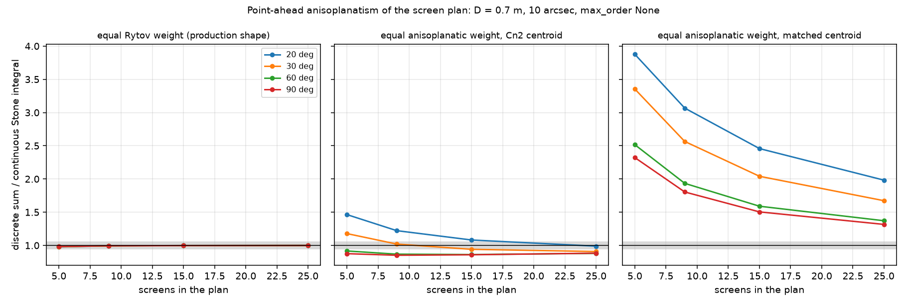
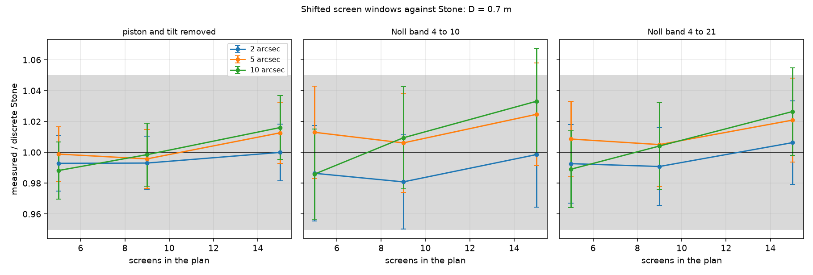

# The screen plan against the point-ahead anisoplanatism

Date 2026-09-11, branch `waveoptics-pointahead`, backlog 2-P4. Both studies
run on a laptop CPU. No campaign, no propagation.

## The purpose

A pre-compensated uplink senses the downlink beacon and launches ahead of it
by the point-ahead angle. In the plane-parallel screen model the two paths
cross screen j at a lateral offset `theta * z_g,j`, where `z_g,j` is the
ground distance of the screen. The part of the sensed phase that the two
offsets do not share is the anisoplanatic residual, and Stone et al. (1994)
give its variance as a continuous integral over the Cn2 profile.

The fidelity-2 runner replaces that integral with a sum over its screens. Two
questions follow, and the owner suspected that the answer to the first one is
"more screens near the ground, where the offset is small":

1. Does the production screen plan (equal Rytov weight, 9 screens at the
   standard preset) reproduce the continuous Stone variance, and does a plan
   cut by the anisoplanatic weight do better?
2. Does a screen drawn once and read through two integer-pixel windows give
   the Stone variance when the two windows are summed and differenced?

THE CASE. The hero of `validation/waveoptics_ao/` turned around: a 1550 nm
uplink from a 700 mm ground SMF terminal to a 100 mm space terminal at 500 km,
HV5/7 site, `L0 = 25 m` on the screens where the study says so, the standard
preset grid (512 px at every elevation). The ground transmitter fills the
aperture (waist 0.35 m). `common.py` holds the case and the plan builders.

## The run lines

    C:\Users\alexf\anaconda3\envs\olb\python.exe -m validation.anisoplanatism_screens.anisoplanatism_screens
    C:\Users\alexf\anaconda3\envs\olb\python.exe -m validation.anisoplanatism_screens.phase_only_shift
    C:\Users\alexf\anaconda3\envs\olb\python.exe -m validation.anisoplanatism_screens.phase_only_shift --L0 25

The first script takes 2.5 minutes. The second takes 15 minutes at the
default 100 draws; `--n-draws 10` is the smoke run. Each script writes its log,
its results JSON and its figure next to itself.

## Study 1: the discrete Stone sum of a plan (`anisoplanatism_screens.py`)

The script evaluates the delta-layer form of Stone Eq. (29) on a screen plan:

    sigma^2 = 2 (2 pi)^(8/3) C_A k0^2 R^(5/3) SUM_j m_j I(z_g,j theta / R)

where `m_j` is the slant Cn2 integral of screen j (`ScreenPlan.cn2_int_m13`,
which already carries the airmass factor), `R = D/2`, and `I(beta)` is the
Stone inner integral of `olb/turbulence/anisoplanatism.py` with the piston
and the tilt removed. The reference is the continuous integral of the same
module on the fine height grid of the planner (ratio 0.9997 against the
library function).

The sweep: elevations 20, 30, 60, 90 deg; apertures 0.4, 0.7, 1.0 m; angles
2, 5, 10 arcsec plus the geometry angle; `max_order` 3 (AO of 10 Noll modes),
5 (21 modes) and None (every order). Plans: the production plan, the
equal-Rytov override at 5, 9, 15, 25 screens, the ground split (the lowest
screen cut in 4), and two equal-anisoplanatic-weight families (the slab cut
at equal shares of `Cn2 sec (h sec)^2`, the screen at the Cn2 centroid or at
the matched centroid).

The production plan at D = 0.7 m, `max_order` None:

| elevation | angle [arcsec] | continuous [rad^2] | discrete [rad^2] | ratio |
| --- | --- | --- | --- | --- |
| 20 | 10.0 | 1.237 | 1.229 | 0.994 |
| 30 | 10.0 | 0.703 | 0.699 | 0.993 |
| 60 | 10.0 | 0.309 | 0.307 | 0.994 |
| 90 | 10.0 | 0.249 | 0.247 | 0.994 |
| 30 | 5.24 (geometry) | 0.509 | 0.506 | 0.994 |

The per-screen shares at 30 deg, 10 arcsec, D = 0.7 m: the top screen
(16.2 km, offset 1.57 m) holds 5.5 percent of the variance, the screen at
2.0 km (offset 0.19 m) holds the most at 22.8 percent, and the two lowest
screens (0.57 km and 0.08 km, offsets 8.0 px and 1.1 px) hold 21.4 percent
together.

**VERDICT: NO PLANNER CHANGE.** Over the 135 production cells of the owner
regime (D at most 1 m, angle at most 10 arcsec, elevation at least 20 deg)
the 9-screen ratio holds between 0.982 and 1.003. The worst cell is 20 deg,
D = 0.4 m, 10 arcsec, `max_order` 3 at 0.982. The equal-anisoplanatic-weight
families do NOT improve it: a slab that is thick in height breaks the
small-angle limit that the centroid assumes, and the worst owner-regime ratio
of that family is 4.94 at 5 screens. The integer-pixel rounding of the
offsets moves the production ratio by at most +0.075 (20 deg, D = 0.4 m,
5 arcsec). The suspicion that the ground layers need more screens is not
supported: the lowest screen holds 4.9 percent of the variance at an offset
of one pixel, and the ground split moves nothing.

## Study 2: the shifted screen windows (`phase_only_shift.py`)

The script draws each screen ONE time on an oversize grid with the production
`ScreenFactory` (the same L0, subharmonics and precision as the runner), reads
the beacon window `scr[0:n, 0:n]` and the uplink window `scr[0:n, s_j:s_j+n]`
with `s_j = round(theta z_g,j / dx)`, sums the difference over the plan, and
fits 36 Noll modes over 16 disjoint 0.7 m apertures (25 of 0.4 m) for each of
100 draws. Three quantities: the piston-and-tilt-removed variance, and the
Noll bands 4 to 10 and 4 to 21 (the `max_order` 3 and 5 of Stone). The
reference is the delta-layer sum of study 1 at the SAME rounded offsets, and
the continuous integral as a second column.

At `L0 = inf`, D = 0.7 m, the production count (9 screens):

| angle [arcsec] | quantity | measured [rad^2] | Stone [rad^2] | ratio +- 2 sigma |
| --- | --- | --- | --- | --- |
| 2 | piston, tilt removed | 0.275 | 0.277 | 0.993 +- 0.017 |
| 5 | piston, tilt removed | 0.508 | 0.511 | 0.996 +- 0.019 |
| 10 | piston, tilt removed | 0.690 | 0.692 | 0.998 +- 0.020 |
| 10 | band 4 to 10 | 0.393 | 0.389 | 1.009 +- 0.033 |
| 10 | band 4 to 21 | 0.504 | 0.502 | 1.004 +- 0.028 |

**VERDICT: the window rule holds.** 54 of 54 cells (5, 9, 15 screens and the
ground split, three angles, two apertures, three quantities) sit inside the
0.95 to 1.05 band or inside their own 2-sigma bar; the worst cell is 5
screens, 10 arcsec, D = 0.4 m, band 4 to 10 at 0.965 +- 0.023. The
sub-pixel arm shows why the rounding matters at the bottom: with the two
lowest screens forced to 0 px the piston-and-tilt-removed variance at 10
arcsec falls from 0.690 to 0.548 rad^2 (the true offsets are 8.0 and 1.1 px),
so the runner must keep the rounded offset of every screen, and it does.
The `--L0 25` run is the second log of this folder; see its verdict line.

## The caveats

- Stone is Kolmogorov. The screens of record carry `L0 = 25 m`, so the
  comparison of record is at `L0 = inf` and the 25 m run reports the
  departure.
- Both studies are phase only. The propagated check (diffraction between the
  screens, the reciprocity overlap, the AO correction) is the campaign study
  `validation/waveoptics_pointahead/`.
- The plane-parallel offset `theta z_g` ignores the Earth curvature. At
  20 deg and 58 km of slant path the error is under 1 percent of the offset.

## The files

| File | Purpose |
| --- | --- |
| `common.py` | The hero uplink case, the plan builders (production, override, ground split, equal anisoplanatic weight) and the log helpers. |
| `anisoplanatism_screens.py` | Study 1. Writes `anisoplanatism_screens.log`, `_results.json`, `figures/discrete_vs_continuous.png`. |
| `phase_only_shift.py` | Study 2. Writes `phase_only_shift[_L0<m>].log`, `_results.json`, `figures/phase_only_shift[_L0<m>].png`. |

## Sources

- J. Stone, P. H. Hu, S. P. Mills and S. Ma, J. Opt. Soc. Am. A 11(1),
  347-357 (1994), DOI 10.1364/JOSAA.11.000347. Eqs. (27), (29), (36), (43).
- R. J. Noll, J. Opt. Soc. Am. 66, 207 (1976), DOI 10.1364/JOSA.66.000207.
- L. C. Andrews and R. L. Phillips, 2nd ed. (2005), DOI 10.1117/3.626196.
  Ch. 12, Eq. (14), the plane-parallel airmass.
