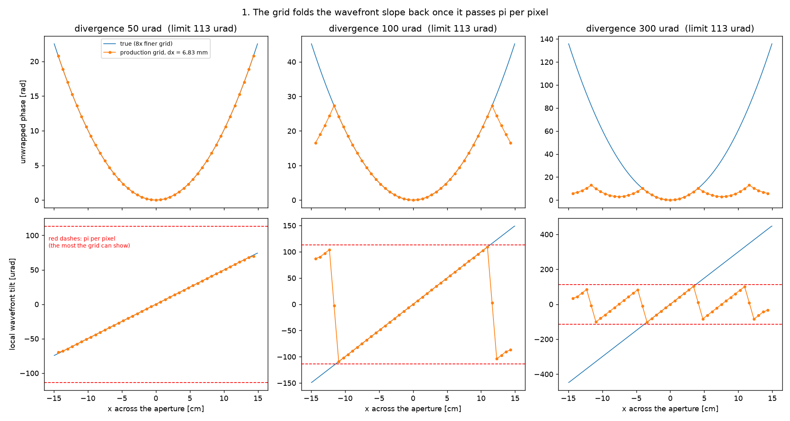
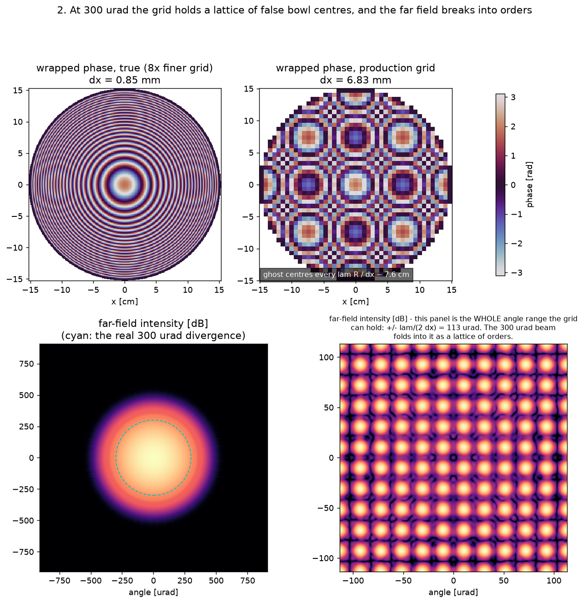
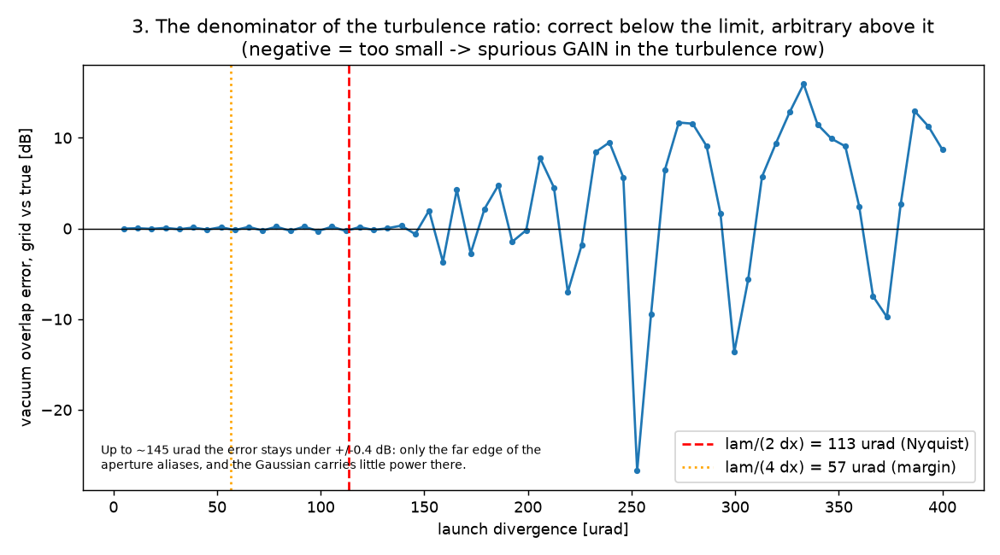

# divergence_sampling

**The grid-sampling limit of a DELIBERATELY DIVERGED fidelity-2 uplink.
VERDICT: the fidelity-2 space uplink accepts a diverged launch, but the space
sizer does not read the launch curvature. Past about `lambda / (2 dx)` the
transmit mode ALIASES, the turbulence Term is WRONG, and nothing warns. On the
test case the limit is 113 urad, and a 300 urad launch gives a turbulence
"loss" of about -9 dB (a false GAIN).** (2026-09-23)

## Where the divergence enters

A space uplink at fidelity 2 has two rows that read the divergence:

- The geometric loss is the ANALYTIC Term (`geometric_loss_term`). It reads
  `Transmitter.divergence_rad`, and it does not use the grid. It is CORRECT at
  every divergence.
- The turbulence Term reads the fade through the Shapiro reciprocity overlap
  (DOI 10.1364/JOSA.61.000492):

      eta_turb = |sum(F_turb psi_tx)|^2 / |sum(F_vac psi_tx)|^2      (NO conjugate)

  `psi_tx` is the ground transmit mode (`_ground_transmit_mode` in
  `olb/waveoptics/turbulence/run.py`). It is a Gaussian at the virtual waist,
  moved forward to the aperture plane, so it carries the curvature of the
  diverged launch. It lives on the TURBULENT grid, which the sizer makes from
  the slab and the apertures only.

## The sampling rule

A diverged beam has a parabolic phase of radius R in the aperture plane. Its
local spatial frequency is `x / (lambda R)` (Schmidt (2010),
DOI 10.1117/3.866274, Ch. 7, Eq. (7.37), printed p. 122). So the local
wavefront tilt grows linearly across the aperture. At the edge of a beam that
fills the aperture, the tilt is about the divergence theta. A grid of pitch dx
holds tilts up to

    theta_max = lambda / (2 dx)

(Schmidt, Ch. 7, Eq. (7.7), printed p. 117; `olb.waveoptics.schmidt.sampling.
nyquist_max_angle`). In pixels, the phase step at the edge is
`2 pi theta dx / lambda`, and the rule is that step < pi.

## What aliasing does to the phase

Past the radius where the tilt reaches theta_max, the sampled tilt FOLDS BACK:
the grid cannot tell a step of phi from a step of phi - 2 pi. The phase then
flattens, reaches a new stationary point, and curves again. The pattern is
exact: at `x + X`, with `X = lambda R / dx`, the phase `pi x^2 / (lambda R)`
changes by `2 pi n` (whole turns at every pixel) plus a constant. So the grid
holds the true bowl at the centre plus COPIES of it on a square lattice of
spacing X, each copy with its own constant phase `pi m^2 lambda R / dx^2`.
The Gaussian AMPLITUDE stays correct; only the phase is wrong.

It is NOT a "less divergent beam". It acts as a lattice of zone plates, and
its far field is a lattice of diffraction orders inside the only angle range
the grid can hold, +/- theta_max.

## Why the error can be a GAIN

The denominator (the vacuum overlap) is a fine cancellation: the plane wave
against a curved mode, where neighbouring Fresnel zones cancel. That is
correct physics: a diverged beam puts little power on axis. The copies of the
aliased mode add their own on-axis parts with ARBITRARY constant phases, so
they cancel more or less than the true mode. The turbulent numerator has a
scrambled phase, so it does not follow that cancellation. The ratio then moves
by the error of the denominator. At 300 urad the denominator is 22x (13 dB)
too small, and the mean eta_turb is 106. At about 330 urad the same error is
+16 dB, and the row gives a false LOSS. So the SIGN of the error is not
predictable, and no correction after the run is possible.

## The method

One scenario: a 0.3 m ground aperture, a 0.1 m waist, 1550 nm, a 600 km orbit
at 30 deg, the `rapid` preset. The script takes the PRODUCTION turbulent grid
from `run_fidelity2` (256 px at 6.83 mm), and it builds `psi_tx` with the
production `_ground_transmit_mode` on that grid and on a grid 8x finer at the
same side (0.85 mm, good to about 900 urad). The fine grid is the TRUE
reference.

## The results

| divergence | phase step at the edge | vacuum overlap, grid / true | mean eta_turb (16 trials, after the conjugate fix) |
| --- | --- | --- | --- |
| none | 0 rad/px | 1.00 | 0.378 |
| 100 urad | 2.77 rad/px | 0.91 (-0.4 dB) | 1.245 (NOT grid-converged, see below) |
| 300 urad | 8.31 rad/px | 0.046 (-13 dB) | 106 (every trial > 1) |

- Below theta_max the vacuum-overlap error stays under 0.28 dB.
- The USABLE limit for this beam is about 145 urad, a little past theta_max:
  only the far edge of the aperture aliases, and the Gaussian (w = 0.1 m in a
  0.15 m radius) carries little power there. A beam that fills the aperture
  more tightly has less of that grace.
- Above about 150 urad the error swings between -26.7 dB and +15.9 dB.
- The vacuum-overlap column puts psi_tx against an IDEAL unit plane wave. It
  isolates the aliasing of psi_tx. The production denominator puts psi_tx
  against the grid vacuum field F_vac, which is NOT a plane wave (see the
  second follow-up below).

`1_phase_cut.png`: the unwrapped phase and the local tilt along one cut. At
50 urad the grid follows the truth. At 100 urad it holds to about +/- 11 cm,
then the tilt jumps across the pi-per-pixel line. At 300 urad the tilt is a
sawtooth with a 7.6 cm period, and the unwrapped phase stays under 12 rad
where the true bowl reaches 135 rad.

`2_phase_map.png`: the wrapped phase inside the aperture at 300 urad, true
against the grid (a 3 x 3 lattice of false bowl centres, 7.6 cm apart), and
the far field of each. The true far field is a smooth disc of about 300 urad.
The grid panel IS the whole angle range of the grid (+/- 113 urad), and the
beam folds into it as a lattice of orders.

`3_overlap_error.png`: the vacuum-overlap error (the denominator of
eta_turb) against the divergence, over 5 to 400 urad.

## What to do

- A guard in the space sizer (`turbulent_grid` / `_plan_space` in
  `olb/waveoptics/turbulence/sampling.py`): make the pitch at most
  `lambda / (4 theta)` for a diverged launch (a factor-2 margin on Eq. (7.7)),
  or at least warn. It is NOT BUILT.
- Until then, check `lambda / (2 dx)` against `divergence_rad` before you
  trust a fidelity-2 uplink with a diverged launch.
- A stored uplink `Campaign` cannot sweep the divergence after the run:
  `recouple_point_ahead` builds `psi_tx` from the campaign scenario. The
  small-waist launch (backlog 2-P4a) has the same limit.

## Follow-up 1 (2026-09-23): the overlap took a wrong conjugate. FIXED.

The runner computed `|sum(F conj(psi_tx))|^2`, the mode-match form of two
fields that travel the SAME way. Reciprocity (Shapiro, DOI
10.1364/JOSA.61.000492) puts the up-going launch against the down-coming
field, and the Green's function is symmetric, so the correct form is
`|sum(F psi_tx)|^2` with NO conjugate. The optimum launch is then
`psi_tx = conj(F)`, which is phase conjugation. A real `psi_tx` (every
collimated launch) gives the same number either way, so every earlier study is
bit-identical. A CURVED `psi_tx` with the conjugate read the OPPOSITE
curvature: a diverged launch was a converging beam that focused about
`R = w / theta` in front of the telescope. The fix is
`olb.waveoptics.turbulence.run.reciprocity_overlap`; its module self-check
tests the rule against direct propagation (a lens of f = +/- 2L in vacuum, and
one phase screen). Before the fix, the table read 0.686 at 100 urad and 10.6
at 300 urad.

## Follow-up 2 (2026-09-23): a diverged launch is NOT grid-converged. OPEN.

The mean eta_turb of a diverged launch moves with the pixel count at a FIXED
grid side and screen plan (64 trials, seed 7, rapid):

| divergence | 256 px | 512 px | 1024 px |
| --- | --- | --- | --- |
| none | 0.270 +/- 0.028 | 0.222 +/- 0.025 | - |
| 50 urad | 0.563 +/- 0.049 | 0.718 +/- 0.046 | 1.795 +/- 0.176 |
| 100 urad | 1.090 +/- 0.089 | 0.774 +/- 0.039 | 0.768 +/- 0.060 |

A mean above 1 is not physical here: the far field of this launch falls
monotonically from the axis, so turbulent blurring can only LOWER the mean
on-axis irradiance. The long-term estimate with the Kolmogorov plane-wave
coherence (r0 = 0.127 m, L0 infinite) is 0.79 at 50 urad and 0.96 at
100 urad. The collimated launch moves inside its error bar.

THE CAUSE, most likely: the vacuum baseline is not a plane wave. The slab
starts from a plane wave that fills the grid, and the absorbing edge makes
Fresnel rings over the 20 km slab (the Fresnel scale `sqrt(lambda z)` is about
0.18 m, not small against the 1.75 m grid). Inside the 0.3 m aperture, `|F_vac|`
spans 0.22 to 1.32 at 256 px, 0.78 to 1.30 at 512 px and 0.80 to 1.47 at
1024 px, with 0.5 to 0.7 rad of phase ripple. Rings are circular chirps, and
so is a curved `psi_tx`, so the overlap of the two picks up the ring pattern,
and that pattern changes with the pixel count. The turbulent numerator
scrambles the rings and the denominator keeps them, so the ratio is no longer
a pure turbulence penalty. A collimated `psi_tx` has no chirp and is much
less sensitive, which agrees with the earlier FAST parity of the collimated
uplink. NOT tested yet: a wider grid side (weaker rings), or a baseline that
does not depend on the rings.

## Run

    python -m validation.divergence_sampling.divergence_sampling

It writes the three figures to `figures/`, it prints the grid, the error
bounds and the turbulent smoke run, and it asserts that the overlap is exact
below `theta_max / 2` and wrong by more than 5 dB past `2 theta_max`.

| File | Purpose |
| --- | --- |
| [divergence_sampling.py](divergence_sampling.py) | The whole study: the phase cut, the phase map and far field, the overlap-error sweep, and the 16-trial turbulent smoke run. |
