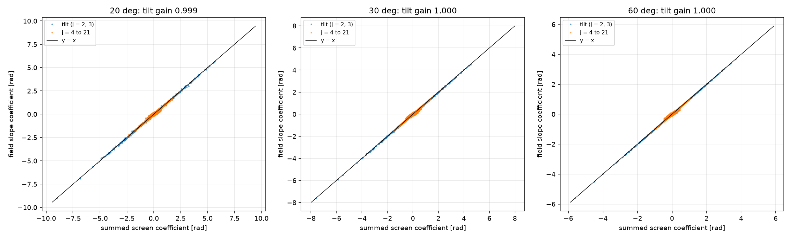
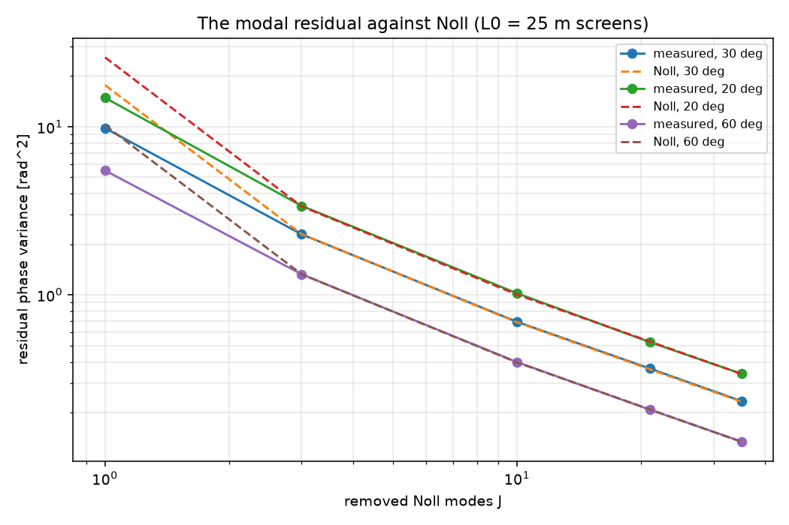
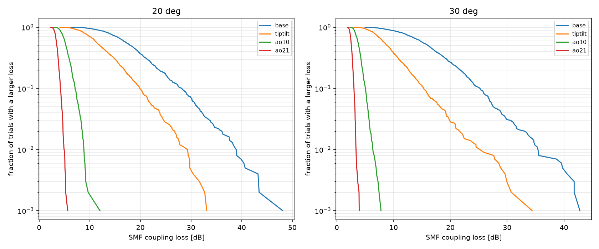

# The perfect-AO validation of the fidelity-2 layer (backlog 2-AO)

Date: 2026-09-07. Branch `waveoptics-ao`. Machine: the desktop `bigfraw`, on the
CUDA FFT backend (`fft_backend="cupy"`, one device, one process).

## The purpose

The fidelity-2 wave-optics layer now removes the first N Noll modes of the
wavefront over the receive aperture (`olb/waveoptics/compensation/`). This study
measures that chain, and it answers four questions:

1. Is the SUMMED SCREEN PHASE a valid sensing source on a space link? (V0)
2. Does the modal chain obey Noll's residual law? (V2)
3. Does the correction move the single-mode-fibre (SMF) fade in the safe
   direction, and by how much? How far is the corrected field from the tracked
   fidelity-1 FAST Term? (V1)
4. Does the wrapped-gradient slope source agree with the summed-screen source?
   (V3) Does it survive a terrestrial link? (V4)

THE CASE (the hero downlink, copied from `validation/tail_convergence/`): a
1550 nm space-to-ground link to a 700 mm ground telescope with an SMF receiver,
from a 100 mm space terminal at 500 km. Site `cn2_ground = 1.7e-14`,
`wind_rms = 21 m/s`. Preset `standard`, seed 20260907, single precision,
`L0 = 25 m` on EVERY run (the owner rule of 2026-09-05, backlog 2-P5).

## The run lines

From the repository root on `bigfraw`. The GPU python is
`C:\Users\alexf\olb-gpu-venv\Scripts\python.exe`.

    python -m validation.waveoptics_ao.waveoptics_ao \
        --study v1 --elevations 30 20 --n-trials 1000 --block-size 50 \
        --check-trials 200 --fast-samples 1000
    python -m validation.waveoptics_ao.waveoptics_ao \
        --study v0 v2 v3 --elevations 30 20 60 --n-trials 200 \
        --block-size 50 --control-seeds 200
    python -m validation.waveoptics_ao.waveoptics_ao \
        --study v4 --n-trials 500 --paths-km 2 10 --cn2 3e-15 --preset rapid

V1 makes the campaigns; V0, V2 and V3 read them and add one 60 deg campaign of
200 trials. V4 reopens two stored 2-TC terrestrial campaigns and computes NO
trial, so it runs on the host python. Add `--analyse-only` to read what is
stored. Add `--fft-backend numpy` on a host with no CUDA device.

THE COST. Eight campaigns of 1000 trials (two elevations x four stacks) plus one
of 200: 8200 trials, 638 MB on disk, about 11 minutes of GPU wall time. One
trial takes 0.069 s uncorrected and 0.083 s with 21 corrected modes, at 512 px
and 9 screens. A corrected trial keeps the HOST tail (it downloads the receive
field one time), so it costs about 20 percent more than an uncorrected one. The
campaigns live under `validation/waveoptics_ao/campaigns/` and they are
gitignored; the logs, the JSON records and the figures are committed.

## V0: the trust gate of the summed-screen source

A space link senses the SUMMED SCREEN PHASE, because the downlink slab starts
from a plane wave. That sum holds no diffraction between the screens. So the
question is: does the sum equal the phase that ARRIVES at the aperture? The
check fits BOTH sources with the same 21-mode projector: the sum through
`estimate`, and the receive field through `estimate_from_slopes` (the
wrapped-gradient route, which needs no unwrap).

200 trials for each elevation. The grid is 512 px in every case.

| elev | sigma2_R | D/r0 | pixel | D [px] | tilt gain | tilt dRMS | tilt RMS | 21 gain | 21 dRMS | resid | res/scr | worst step |
| --- | --- | --- | --- | --- | --- | --- | --- | --- | --- | --- | --- | --- |
| 60 deg | 0.081 | 3.96 | 5.59 mm | 125 | 0.9999 | 0.010 | 1.443 | 0.9884 | 0.041 | 0.490 | 0.255 | 0.61 |
| 30 deg | 0.222 | 5.50 | 6.86 mm | 102 | 0.9998 | 0.029 | 1.938 | 0.9884 | 0.057 | 0.653 | 0.256 | 1.00 |
| 20 deg | 0.444 | 6.91 | 8.68 mm | 81 | 0.9987 | 0.059 | 2.390 | 0.9867 | 0.076 | 0.796 | 0.254 | 2.65 |

All the coefficient columns are in rad. `tilt gain` is the field tilt regressed
on the screen tilt (Noll j = 2 and j = 3); 1.0 means the two sources agree.
`dRMS` is the RMS difference of the two coefficient sets, and `tilt RMS` is the
RMS screen tilt, so the RELATIVE tilt error is 1.5, 1.5 and 2.5 percent.
`21 gain` covers j = 2 to 21. `resid` is the RMS of the summed screen phase
after the removal of the FIELD's own 21-mode fit, and `res/scr` divides that by
the RMS screen phase over the aperture. `worst step` is the largest wrapped
phase difference of the field, in rad per pixel; the warn level of the slope
method is 2.8 rad, and it aliases above pi.

VERDICT: method (c) is TRUSTED at 60, 30 and 20 deg. The tilt gain stays inside
0.2 percent of 1.0, and the 21-mode gain inside 1.4 percent, over the whole
tested band sigma2_R = 0.08 to 0.44. The residual `res/scr` is FLAT at 0.255
across the three elevations: it is the fitting error of the modes above 21, not
a disagreement between the two sources. The 20 deg worst step of 2.65 rad is
close to the 2.8 rad warn level, so the 20 deg reading is the edge of the
FIELD-SLOPE reference, not of the summed-screen source itself.

## V2: the Noll cross-check (the strongest check)

The study fits the first J Noll modes to the summed screen phase over the
aperture, and it takes the variance of what is left. That goes against

    sigma^2 = Delta_J (D / r0)^(5/3)

Source: R. J. Noll, J. Opt. Soc. Am. 66(3), 207 (1976),
DOI 10.1364/JOSA.66.000207, Table IV, printed p. 210. `Delta_1 = 1.0299` and
`Delta_3 = 0.134` are the printed values; J = 10, 21 and 35 take the asymptotic
`0.2944 J^(-sqrt(3)/2)`. All three constants come from `olb/turbulence/ao.py`,
so the study measures the values that the ANALYTIC ladder uses.

THE FRIED PARAMETER is `plan.r0_total_m`, the plane-wave composite of the screen
plan. It agrees with the analytic slant profile
(`olb.turbulence.ao.plane_wave_fried_parameter_profile` over `DEFAULT_HS`) to
2.3 percent at every elevation: 12.73 against 12.44 cm at 30 deg, 10.13 against
9.90 cm at 20 deg, and 17.69 against 17.29 cm at 60 deg. FAST reads 12.42 cm at
30 deg on its own line of sight, which agrees with the analytic value.

200 trials for each elevation. The +- bar is the 68 percent bootstrap of the
mean.

| J | 60 deg (D/r0 3.96) | | | 30 deg (D/r0 5.50) | | | 20 deg (D/r0 6.91) | | |
| --- | --- | --- | --- | --- | --- | --- | --- | --- | --- |
| | measured | Noll | ratio | measured | Noll | ratio | measured | Noll | ratio |
| 1 | 5.4875 +-0.309 | 10.1918 | 0.538 | 9.8013 +-0.553 | 17.6527 | 0.555 | 14.8416 +-0.791 | 25.8065 | 0.575 |
| 3 | 1.3261 +-0.044 | 1.3261 | 1.000 | 2.2899 +-0.074 | 2.2968 | 0.997 | 3.3809 +-0.116 | 3.3577 | 1.007 |
| 10 | 0.3987 +-0.007 | 0.3966 | 1.005 | 0.6913 +-0.011 | 0.6870 | 1.006 | 1.0217 +-0.018 | 1.0043 | 1.017 |
| 21 | 0.2078 +-0.003 | 0.2086 | 0.996 | 0.3649 +-0.005 | 0.3613 | 1.010 | 0.5239 +-0.007 | 0.5282 | 0.992 |
| 35 | 0.1345 +-0.001 | 0.1340 | 1.004 | 0.2339 +-0.003 | 0.2321 | 1.008 | 0.3402 +-0.004 | 0.3394 | 1.002 |

The variances are in rad^2.

VERDICT: the modal chain MATCHES Noll from J = 3 up. The ratio stays inside
1.7 percent of 1.0 at every J of 3, 10, 21 and 35, and at every elevation. That
validates the Zernike raster, the Noll order, the normalisation, the
pseudo-inverse reconstructor and the aperture mask in one measurement.

THE J = 1 ROW READS LOW BY DESIGN. Noll's law is Kolmogorov, which has an
INFINITE outer scale. The screens run at `L0 = 25 m`, so they hold less tilt.
The control below isolates that: it makes ONE screen of the composite r0 on the
SAME grid, at both outer scales, and it fits the same ladder. It runs no
propagation.

| J | 60 deg L0 = 25 m | 60 deg L0 = inf | 30 deg L0 = 25 m | 30 deg L0 = inf | 20 deg L0 = 25 m | 20 deg L0 = inf |
| --- | --- | --- | --- | --- | --- | --- |
| 1 | 0.603 | 0.785 | 0.608 | 0.804 | 0.614 | 0.825 |
| 3 | 0.969 | 0.973 | 0.950 | 0.955 | 0.957 | 0.962 |
| 10 | 0.991 | 0.991 | 0.995 | 0.996 | 0.998 | 0.998 |
| 21 | 0.981 | 0.981 | 0.977 | 0.977 | 0.986 | 0.986 |
| 35 | 0.996 | 0.997 | 0.985 | 0.985 | 0.986 | 0.986 |

200 single screens for each cell. The outer scale moves J = 1 only: 0.60 at
25 m against 0.80 at inf. Every J of 3 and above moves by less than 0.6 percent,
because those fits remove the tilt first. The `L0 = inf` column does not reach
1.0 either, because the three subharmonic levels reach 27 times the grid side
only, so the screens hold a FINITE outer scale even when the caller asks for
inf. That is the known item 2-P5, and it is not a fault of the modal fit.

So the J = 1 deficit of the campaign (0.54 to 0.58) is the OUTER SCALE, and the
single-screen control reproduces most of it (0.60 to 0.61). The rest is the
split step: the campaign sums nine screens over a 20 km slab.

## V1: the fade of the corrected hero downlink

Four campaigns for each elevation: no correction, `TipTilt()` (3 Noll modes),
`AO(n_modes=10)` and `AO(n_modes=21)`. 1000 trials each. `pX` is the loss that
the link EXCEEDS X percent of the time, so `p1` is the deep fade.

THE SMF COUPLING LOSS `-10 log10(smf_eta)` [dB] at 30 deg:

| stack | modes | mean | p50 | p10 | p5 | p1 | d_p5 | d_p1 | p5 gain |
| --- | --- | --- | --- | --- | --- | --- | --- | --- | --- |
| base | 0 | 16.83 | 16.08 | 25.18 | 27.51 | 35.30 | 11.43 | 19.22 | 0.00 |
| tiptilt | 3 | 9.86 | 8.86 | 15.26 | 18.09 | 24.53 | 9.23 | 15.67 | 9.42 |
| ao10 | 10 | 3.95 | 3.85 | 5.04 | 5.41 | 6.29 | 1.55 | 2.43 | 22.10 |
| ao21 | 21 | 2.59 | 2.56 | 3.01 | 3.17 | 3.36 | 0.60 | 0.80 | 24.34 |

At 20 deg:

| stack | modes | mean | p50 | p10 | p5 | p1 | d_p5 | d_p1 | p5 gain |
| --- | --- | --- | --- | --- | --- | --- | --- | --- | --- |
| base | 0 | 19.06 | 18.14 | 28.13 | 31.12 | 38.58 | 12.98 | 20.44 | 0.00 |
| tiptilt | 3 | 13.11 | 12.00 | 19.84 | 22.53 | 28.59 | 10.53 | 16.59 | 8.60 |
| ao10 | 10 | 5.49 | 5.30 | 7.10 | 7.79 | 8.82 | 2.49 | 3.52 | 23.33 |
| ao21 | 21 | 3.56 | 3.51 | 4.21 | 4.48 | 4.89 | 0.97 | 1.38 | 26.64 |

`d_pX` is the FADE DEPTH `pX - p50`. `p5 gain` is the p5 improvement against the
base.

THE BUCKET LOSS DOES NOT MOVE. The correction is a phase factor, so the
collected power must not change. It does not, to every printed digit: at 30 deg
every stack reads mean 0.017 dB, p50 0.010, p5 0.497 and p1 0.720; at 20 deg
every stack reads mean 0.059, p50 0.055, p5 0.928 and p1 1.258.

THE POST-HOC ROUTE EQUALS THE IN-RUN ROUTE.
`Campaign.recouple_compensated([TipTilt()], SMF(...), source="screens")` on the
UNCORRECTED campaign reproduces the in-run TipTilt campaign trial for trial:
the worst relative difference is 1.06e-07 at 30 deg and 1.40e-07 at 20 deg over
200 trials (RMS 4.2e-08 and 4.7e-08). That is the single-precision rounding
level. So a stored uncorrected campaign holds every corrected answer.

THE FIDELITY-1 FAST COMPARISON. Both models take `L0 = 25 m`, the SAME
compensation stack, and 1000 draws. FAST maps the stack itself
(`olb.models.fast._ao_params`): an empty stack gives NOAO, TipTilt gives TT, and
AO(n) gives modal AO with ZMAX = n. A grid guard picks the FAST NPXLS first. The
compared quantity is the composite `-10 log10(power * eta)`, the same one that
`validation/waveoptics_vs_fast/` used.

| elev | stack | FAST mode | FAST mean | field mean | gap | FAST p5 | field p5 |
| --- | --- | --- | --- | --- | --- | --- | --- |
| 30 deg | base | NOAO | 16.83 | 16.84 | -0.02 | 29.28 | 27.64 |
| 30 deg | tiptilt | TT | 9.48 | 9.88 | -0.40 | 16.76 | 18.07 |
| 30 deg | ao10 | AO, ZMAX 10 | 4.06 | 3.96 | +0.09 | 5.70 | 5.52 |
| 30 deg | ao21 | AO, ZMAX 21 | 2.62 | 2.61 | +0.01 | 3.43 | 3.33 |
| 20 deg | base | NOAO | 19.19 | 19.12 | +0.07 | 30.34 | 31.36 |
| 20 deg | tiptilt | TT | 12.67 | 13.17 | -0.50 | 22.67 | 22.58 |
| 20 deg | ao10 | AO, ZMAX 10 | 5.68 | 5.55 | +0.12 | 8.01 | 7.86 |
| 20 deg | ao21 | AO, ZMAX 21 | 3.55 | 3.62 | -0.07 | 4.88 | 4.81 |

The gap is FAST minus field. A POSITIVE gap means the field reads LESS loss.

VERDICT: tip-tilt moves the SMF p5 in the SAFE direction by 9.4 dB at 30 deg and
8.6 dB at 20 deg. AO(10) gives 22.1 and 23.3 dB, and AO(21) gives 24.3 and
26.6 dB. The FADE DEPTH falls with the mode count too: at 30 deg `d_p5` goes
11.4 -> 9.2 -> 1.6 -> 0.6 dB. So a tip-tilt corrector removes about a third of
the fade depth, and the first ten modes remove almost all of it.

THE CORRECTED FIELD AND THE TRACKED FIDELITY-1 TERM AGREE. The mean gap runs
-0.50 to +0.12 dB over the eight (elevation, stack) pairs. That is as close as
the UNCORRECTED rung of `validation/waveoptics_vs_fast/` (-0.34 to +0.12 dB at
L0 = 25 m). So the 2-AO like-for-like blocker is CLEARED: the AO-corrected
fidelity-1 Terms now have a fidelity-2 partner, and the two agree. The largest
gap sits on the TIP-TILT rung (-0.4 to -0.5 dB, the field reads MORE loss), the
rung where the tilt statistic (and so the outer scale) matters most.

## V3: the slope source against the summed-screen source

Both routes correct the SAME stored field of the SAME uncorrected campaign. Only
the sensing source changes. 200 trials for each cell.

| elev | stack | mean eta (screens) | mean eta (slopes) | rel RMS | rel max | dB RMS | dB max |
| --- | --- | --- | --- | --- | --- | --- | --- |
| 60 deg | tiptilt | 0.27682 | 0.27671 | 0.0056 | 0.0412 | 0.025 | 0.183 |
| 60 deg | ao21 | 0.65856 | 0.63169 | 0.0456 | 0.1104 | 0.205 | 0.508 |
| 30 deg | tiptilt | 0.14578 | 0.14576 | 0.0310 | 0.2420 | 0.141 | 1.203 |
| 30 deg | ao21 | 0.55394 | 0.51922 | 0.0712 | 0.1834 | 0.325 | 0.880 |
| 20 deg | tiptilt | 0.08128 | 0.08154 | 0.1101 | 1.0260 | 0.478 | 4.463 |
| 20 deg | ao21 | 0.44839 | 0.41844 | 0.0851 | 0.2991 | 0.398 | 1.543 |

`rel` is `(slopes - screens) / screens` on the coupling efficiency of one trial.
`dB` is `-10 log10(slopes / screens)`.

VERDICT: the two sources agree on the MEAN tip-tilt correction to better than
0.3 percent at every elevation, which is the V0 tilt-gain result seen through
the coupling. The AO(21) mean is 4 to 6 percent LOW on the slope route (0.2 to
0.3 dB), and that offset grows as the elevation falls. The per-trial spread is
larger than the mean offset: 0.6 to 11 percent RMS, with one 20 deg tip-tilt
trial at 4.5 dB. The 20 deg cell is where the field carries the worst wrapped
step (2.65 rad per pixel, V0), so the slope measurement is near its sampling
limit there.

So: use the SUMMED-SCREEN source on a space link, which is what the runner and
`recouple_compensated` do by default. The slope source is a valid backup at
60 and 30 deg, and it is CONSERVATIVE (it reads slightly less correction). It
needs a finer grid below 30 deg. This table is the same measurement as V0 rows
(i) and (ii), read through the coupling efficiency instead of the coefficients.

## V4: the terrestrial sanity check

The study REOPENS two stored 2-TC campaigns
(`validation/terrestrial_campaigns/`, seed 20260906, L0 = 25 m, single
precision, a collimated 5 mm launch into a 10 cm SMF receiver) and it applies
the correction POST HOC with `source="slopes"`. A horizontal link is near field,
so the summed screen phase over the pupil is not the arriving phase. It computes
no trial. 500 trials of each cell.

THE SMF COUPLING LOSS `-10 log10(smf_eta)` [dB]:

| cell | kind | mean | p50 | p10 | p5 | p1 | d_p5 |
| --- | --- | --- | --- | --- | --- | --- | --- |
| 2 km, Cn2 3e-15, rapid | untracked | 4.05 | 3.85 | 5.42 | 6.10 | 7.15 | 2.25 |
| 2 km, Cn2 3e-15, rapid | tiptilt | 3.25 | 3.23 | 4.06 | 4.27 | 4.94 | 1.04 |
| 2 km, Cn2 3e-15, rapid | ao21 | 0.92 | 0.91 | 1.06 | 1.11 | 1.20 | 0.21 |
| 10 km, Cn2 3e-15, rapid | untracked | 6.90 | 5.97 | 11.96 | 15.29 | 21.31 | 9.32 |
| 10 km, Cn2 3e-15, rapid | tiptilt | 3.42 | 2.64 | 6.08 | 8.45 | 14.97 | 5.81 |
| 10 km, Cn2 3e-15, rapid | ao21 | 2.85 | 2.03 | 5.56 | 8.04 | 13.05 | 6.01 |

The 2 km grid is 1024 px with 5 screens and `r0_total = 10.66 cm`. The 10 km
grid is 1024 px with 11 screens and `r0_total = 4.06 cm`.

THE SAMPLING LIMIT OF THE SLOPE METHOD:

| cell | mean worst step | worst step | trials over the 2.8 rad warn |
| --- | --- | --- | --- |
| 2 km, Cn2 3e-15, rapid | 0.128 | 0.171 | 0.0 % |
| 10 km, Cn2 3e-15, rapid | 2.238 | 3.141 | 42.8 % |

The step is the largest wrapped phase difference between two adjacent pixels of
one trial, in rad per pixel. The wrapped gradient ALIASES above pi.

VERDICT (SANITY ONLY, and it feeds backlog 1-9): the 2 km cell is CLEAN. Not one
trial comes near the warn level, and the numbers are trustworthy: tip-tilt takes
the p5 fibre loss from 6.10 to 4.27 dB, and it takes the fade depth from 2.25 to
1.04 dB. AO(21) takes the p5 to 1.11 dB. The 10 km cell is AT the sampling limit:
43 percent of its trials carry a step above the warn level and the worst step is
3.14 rad, which is pi. So the 10 km tip-tilt line (p5 15.29 -> 8.45 dB) reads
plausible, but the AO(21) line, which is no better than tip-tilt at the p5 and
WORSE at the fade depth, is a measurement of the aliasing, not of the physics.
A trustworthy 10 km number needs a finer grid, or the summed-screen source with
a near-field justification. Do not quote the 10 km AO numbers.

## The caveats

- **PERFECT AO.** The fit is an ideal modal fit with no wavefront-sensor noise,
  no finite subaperture, no aliasing, no servo lag and no branch point. Every
  corrected number here is the UPPER BOUND of the benefit of a corrector.
- **SNAPSHOT ONLY.** There is no time axis, no fade rate and no fade duration
  (backlog 2-P1). The correction is a per-snapshot ideal fit, so it also holds no
  servo bandwidth.
- **NO ANISOPLANATISM AND NO POINT-AHEAD.** The correction senses the SAME field
  that it corrects. A receive-side downlink corrector does that in real life, so
  the downlink result is fair. An UPLINK pre-compensation does not, and this
  study says nothing about it (backlog 2-P4).
- **L0 = 25 m.** Every screen holds that outer scale. The Noll law is Kolmogorov,
  so the J = 1 row of V2 reads low by design (see the control). A study at
  another outer scale gives another tilt statistic (backlog 2-P5).
- **THE SCREENS DO NOT REACH THEIR OWN L0.** Three subharmonic levels reach 27
  times the grid side, so even `L0 = inf` gives a finite outer scale. The V2
  control measures 0.79 to 0.83 of the Kolmogorov J = 1 residual at `L0 = inf`.
- **1000 TRIALS.** The p1 row is the deepest quantile that the sample supports
  (the ten-samples-past-the-availability rule of `olb.results.EmpiricalSampler`).
  Do not read a p0.1 from this data.
- **ONE SEED FAMILY.** Seed 20260907 for the space campaigns, 20260906 for the
  terrestrial ones. The four stacks of one elevation share the atmosphere, so the
  comparison between stacks is a MATCHED-PAIR comparison and it is much sharper
  than the bootstrap bars suggest.

## The files

- `waveoptics_ao.py` -- the study. One argparse driver, `--study v0 v1 v2 v3 v4`.
- `waveoptics_ao_v0.log` and `waveoptics_ao_v0_results.json` (and the same pair
  for v1, v2, v3 and v4) -- the tables above, as printed and as data.
- `run_v1.log`, `run_v023.log`, `run_v4.log` -- the raw stdout of the three
  detached runs on `bigfraw`.
- `figures/` -- `v0_source_agreement.png`, `v2_noll_residual.png` and
  `v1_smf_survival.png`. A PNG is gitignored across the repository, so the run
  makes these three files again from the stored campaigns. Use `--analyse-only`
  to remake them and to compute no trial.
- `campaigns/` -- the stored trials. It is gitignored, and it stays on `bigfraw`.

## Sources

- R. J. Noll, "Zernike polynomials and atmospheric turbulence," J. Opt. Soc.
  Am. 66(3), 207-211 (1976), DOI 10.1364/JOSA.66.000207. Table I (the mode
  order) and Table IV (the residual coefficients).
- D. L. Fried, J. Opt. Soc. Am. 56, 1372 (1966), DOI 10.1364/JOSA.56.001372.
  The Fried parameter r0.
- Schmidt, Numerical Simulation of Optical Wave Propagation (2010),
  DOI 10.1117/3.866274, Ch. 9. The split-step method of the trials.
- Andrews and Phillips, 2nd ed. (2005), DOI 10.1117/3.626196. Ch. 3 the von
  Karman spectrum; Ch. 8 the Rytov variance; Ch. 12 the Hufnagel-Valley profile
  and the airmass.
- O. J. D. Farley and others, Opt. Express 30(13), 23050 (2022),
  DOI 10.1364/OE.458659. The FAST method (fidelity 1).
- Shaklan and Roddier, Appl. Opt. 27, 2334 (1988), DOI 10.1364/AO.27.002334.
  The single-mode-fibre coupling parameter of the terrestrial receiver.
