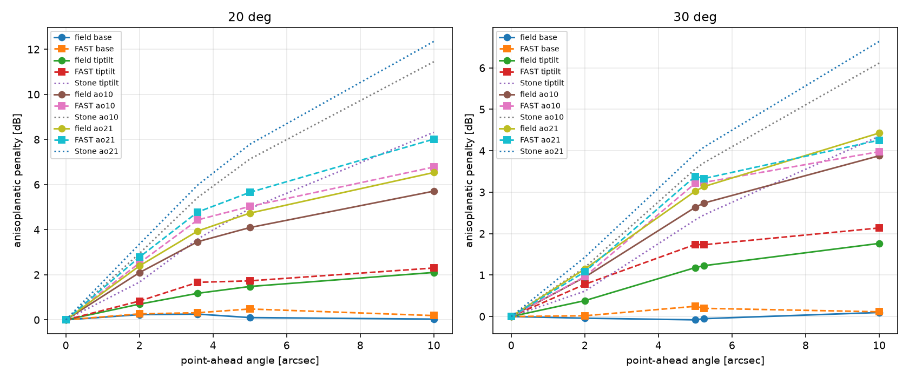
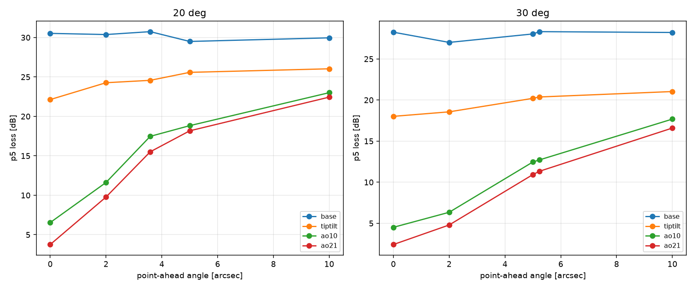

# The point-ahead validation of the fidelity-2 uplink (backlog 2-P4)

Date: 2026-09-11. Branch `waveoptics-pointahead`. Machine: the desktop
`bigfraw`, on the CUDA FFT backend (`fft_backend="cupy"`, one device, one
process).

## The purpose

The fidelity-2 runner now makes ONE MORE propagation pass for each point-ahead
angle (`olb/waveoptics/turbulence/run.py`, `point_ahead_rad`). The ground
terminal senses the DOWNLINK beacon, it applies the conjugate wavefront to the
uplink beam, and the uplink goes to where the satellite WILL BE. The two
directions read the SAME atmosphere through a laterally shifted window of each
screen, so the drop of the reciprocity overlap between them IS the point-ahead
anisoplanatism. Before this work the fidelity-2 pre-compensated uplink carried
the flag NO ANISOPLANATISM, and the model of record stayed the fidelity-1 FAST
Term.

This study answers four questions:

1. Does the record hold together? Is the stored beacon column the beacon
   overlap, does the post-hoc read of the stored planes equal an in-run
   corrected campaign, and does the regeneration route give a stored column
   back? (p0)
2. How large is the penalty, and do the three rungs agree? The field against
   the fidelity-1 FAST Term and against the analytic Stone Term. (p1)
3. What does the point ahead do to the FADE, not only to the mean? (p2)
4. Is the penalty converged in the SCREEN COUNT? (p3)

THE TILT STAYS IN (owner decision, 2026-09-11). The terminal senses the
downlink beacon tilt and the steering mirror adds the point-ahead offset
geometrically, so the uplink has no tilt reference of its own and it pays the
full tilt anisoplanatism. The runner corrects the modes of the stack and it
keeps the tilt in the error; FAST keeps the piston and the tilt in its modal
mask; the Stone Term takes `remove='piston'`. So the three rungs read the SAME
mode set, except the piston, which changes no overlap integral.

THE MODE COUNT IS NOLL, and it is the count of `olb/turbulence/ao.py`:
`TipTilt` removes the first 3 Noll modes and `AO(n)` the first n (R. J. Noll,
DOI 10.1364/JOSA.66.000207, Table I).

## The case

THE HERO UPLINK of `validation/anisoplanatism_screens/common.py`
(`hero_uplink`), which is the hero downlink of `validation/waveoptics_ao/`
turned around: a 1550 nm uplink from a 700 mm ground terminal with a FULL
APERTURE launch (`Transmitter(waist_m=0.35)`) to a 100 mm space terminal at
500 km, with a `DownlinkBeacon` pre-compensation source. Site
`cn2_ground = 1.7e-14`, `wind_rms = 21 m/s`. Preset `standard`, seed 20260907,
single precision, `L0 = 25 m` everywhere (the owner rule of 2026-09-05,
backlog 2-P5): on the screens, in FAST (`fast_params={"L0": 25.0}`) and in the
Stone Term (`L0_m=25.0`).

THE ANGLES of each campaign, in this column order: 0 (the beacon direction),
the GEOMETRIC angle of the elevation
(`olb.geometry.CircularOrbit.point_ahead_rad`, 5.24 arcsec at 30 deg), then 2,
5 and 10 arcsec. `screen_margin_m=None`, so the runner sizes the oversize
screen from the widest angle and the highest screen.

THE STACKS are the four stacks of `validation/waveoptics_ao/`: `base` (no
correction), `tiptilt` (3 Noll modes), `ao10` (10) and `ao21` (21). Only the
`base` campaign is computed: the other three come from it POST HOC, through
`Campaign.recouple_point_ahead`, which corrects the stored planes with the
beacon estimate of any stack and costs no propagation.

## The run lines

From the repository root on `bigfraw`. The GPU python is
`C:\Users\alexf\olb-gpu-venv\Scripts\python.exe`. The login shell of
`ssh desktop` is Windows PowerShell 5.1, so chain with `;`, never with `&&`,
and launch the long run through WMI so it outlives the ssh session
(`validation/campaign_resources/README.md`):

```
$cmd = 'cmd /c "cd /d D:\repos\optical_link_budget && C:\Users\alexf\olb-gpu-venv\Scripts\python.exe -u -m validation.waveoptics_pointahead.waveoptics_pointahead --study p0 p1 p2 p3 > validation\waveoptics_pointahead\run_all.log 2>&1"'
Invoke-CimMethod -ClassName Win32_Process -MethodName Create -Arguments @{CommandLine=$cmd}
```

The defaults ARE the production settings: `--elevations 30 20`,
`--n-trials 1000`, `--count-trials 400`, `--check-trials 200`,
`--block-size 50`, `--fast-samples 1000`, `--fft-backend cupy`,
`--workers` unset (one device, one stream). The studies also run one at a
time:

```
python -m validation.waveoptics_pointahead.waveoptics_pointahead --study p0
python -m validation.waveoptics_pointahead.waveoptics_pointahead --study p1
python -m validation.waveoptics_pointahead.waveoptics_pointahead --study p2
python -m validation.waveoptics_pointahead.waveoptics_pointahead --study p3
```

Add `--dry-run` to print the campaign list and to exit. Add `--analyse-only`
to read what is stored and to compute no trial. Add `--fft-backend numpy` on a
host with no CUDA device, and `--no-fast` when `fast-aosim` is not installed.
`--posthoc-workers 4` opens a process pool for the post-hoc reads.

THE SMOKE RUN, on a laptop, takes a few minutes:

```
python -m validation.waveoptics_pointahead.waveoptics_pointahead \
    --study p0 p1 p2 p3 --fft-backend numpy --preset rapid --n-trials 8 \
    --count-trials 8 --check-trials 4 --elevations 30 --block-size 4 \
    --no-fast
```

## The cost

From `--dry-run` at the production settings:

| campaign | trials | planes | grid | screen | screens | MB |
| --- | --- | --- | --- | --- | --- | --- |
| el30/base | 1000 | 6 | 512 | 768 | 9 | 1263 |
| el30/ao10 | 200 | 6 | 512 | 768 | 9 | 253 |
| el20/base | 1000 | 6 | 512 | 800 | 9 | 791 |
| el20/ao10 | 200 | 6 | 512 | 800 | 9 | 158 |
| el30/n5 | 400 | 6 | 512 | 736 | 5 | 505 |
| el30/n9 | 400 | 6 | 512 | 768 | 9 | 505 |
| el30/n15 | 400 | 6 | 512 | 768 | 15 | 505 |
| el30/n25 | 400 | 6 | 512 | 768 | 25 | 505 |
| el30/ground_split_x4 | 400 | 6 | 512 | 768 | 12 | 505 |
| TOTAL | 4400 | | | | | 4990 |

`planes` is 1 + the angle count: each plane is one split step and one stored
field, so a point-ahead trial costs six passes. At the 2-AO GPU rate of 12.4
trials/s for ONE pass at 512 px and 9 screens, the 4400 trials give 35 minutes
of ideal GPU time. Take 1.5 to 2 times that, because the screen draw is 768 px
(not 512), the `n25` plan holds 25 screens, and a corrected trial keeps the
host tail. So PLAN FOR ABOUT ONE TO TWO HOURS and about 5 GB on disk. The
campaigns live under `validation/waveoptics_pointahead/campaigns/` and they are
gitignored; the logs, the JSON records and the figures are committed.

## p0: the identities of the record

THREE CHECKS on each elevation.

1. `eta_turb_pa[:, 0] == eta_turb`, bit for bit. Angle 0.0 runs the same
   window as the beacon pass, so the two must be the same number.
2. The post-hoc route. `base.recouple_point_ahead([AO(10)])` corrects the
   STORED UNCORRECTED planes; an in-run `ao10` campaign of the same seeds
   corrects inside the run. The gate is 1e-6 relative on every trial and
   angle.
3. The regeneration route. `base.point_ahead([5 arcsec], None)` rebuilds the
   screens from the stored seeds and propagates again; it must give the stored
   5 arcsec column back. The regeneration runs on the numpy backend, so a
   campaign computed on the CUDA backend agrees to the float32 rounding level
   only. The gate is 1e-5, and the log prints the measured error and whether
   the two are bit identical.

| elev | beacon identity | post-hoc max rel | regenerate max rel | bit identical | s/trial | screen px |
| --- | --- | --- | --- | --- | --- | --- |
| 30 deg | PLACEHOLDER | PLACEHOLDER | PLACEHOLDER | PLACEHOLDER | PLACEHOLDER | PLACEHOLDER |
| 20 deg | PLACEHOLDER | PLACEHOLDER | PLACEHOLDER | PLACEHOLDER | PLACEHOLDER | PLACEHOLDER |

VERDICT: PLACEHOLDER.

## p1: the penalty against FAST and against Stone

THE FIELD PENALTY is `L(theta) - L(0)` with `L = -10 log10(mean eta_pa)`. The
beacon column `L(0)` IS the 2-AO perfect pre-compensation loss, and the
point-ahead columns degrade it.

THE FAST PENALTY is the same difference of `olb.models.fast.uplink_fast_term`.
The angle goes in through `fast_params={"DTHETA": [arcsec, 0]}`, which the
Term merges LAST, so it overrides the angle that the Term reads from the
geometry. An NPXLS grid guard runs first at DTHETA = 0 and it pins the
smallest grid within 0.15 dB of the largest, the guard of
`validation/waveoptics_vs_fast/`. Every stack has a FAST row: an empty stack
is the NOAO launch and a tip-tilt stack is the TT launch, the same map as the
downlink Term (the old refusal of an uplink without an AO stage was an olb
guard, lifted 2026-09-11).

THE STONE PENALTY is `olb.links.uplink.uplink_point_ahead_term` with
`remove='piston'` and `L0_m=25.0`, reported as
`loss_db = (10 / ln 10) sigma^2`. The `base` stack has no Stone row: with no
corrected mode there is no decorrelation residual, so the penalty is zero by
definition. The `tiptilt` stack takes `max_order=1` (the tilt is radial order
1); `ao10` and `ao21` take `max_order='auto'`, which reads the AO stage.

THE PASS BAND of the field against FAST is 0.5 dB, the like-for-like tolerance
of `docs/physics.md` Section 9l. Stone is a REPORT, not a gate: the extended
Marechal mapping saturates past sigma^2 = 1 rad^2 (T. S. Ross,
DOI 10.1364/AO.48.001812), so the Stone number reads high at a large angle.

30 deg, 1000 trials, the anisoplanatic penalty in dB:

| stack | angle | field | +- | FAST | gap | band | Stone |
| --- | --- | --- | --- | --- | --- | --- | --- |
| PLACEHOLDER | PLACEHOLDER | PLACEHOLDER | PLACEHOLDER | PLACEHOLDER | PLACEHOLDER | PLACEHOLDER | PLACEHOLDER |

20 deg, 1000 trials:

| stack | angle | field | +- | FAST | gap | band | Stone |
| --- | --- | --- | --- | --- | --- | --- | --- |
| PLACEHOLDER | PLACEHOLDER | PLACEHOLDER | PLACEHOLDER | PLACEHOLDER | PLACEHOLDER | PLACEHOLDER | PLACEHOLDER |

VERDICT: PLACEHOLDER.



## p2: the fade

The per-trial loss is `-10 log10(eta_pa)` of one trial, so pX is the loss the
link EXCEEDS X percent of the time. The p5 penalty is `p5(theta) - p5(0)`, the
extra deep-fade loss of the point-ahead angle. The `+-` bar is the 68 percent
bootstrap half-width over the trial rows; the resample takes whole ROWS, so
the beacon column and the point-ahead column keep their pairing.

30 deg, 1000 trials, the loss in dB:

| stack | angle | mean | p50 | p10 | p5 | p1 | d p5 | +- |
| --- | --- | --- | --- | --- | --- | --- | --- | --- |
| PLACEHOLDER | PLACEHOLDER | PLACEHOLDER | PLACEHOLDER | PLACEHOLDER | PLACEHOLDER | PLACEHOLDER | PLACEHOLDER | PLACEHOLDER |

20 deg, 1000 trials:

| stack | angle | mean | p50 | p10 | p5 | p1 | d p5 | +- |
| --- | --- | --- | --- | --- | --- | --- | --- | --- |
| PLACEHOLDER | PLACEHOLDER | PLACEHOLDER | PLACEHOLDER | PLACEHOLDER | PLACEHOLDER | PLACEHOLDER | PLACEHOLDER | PLACEHOLDER |

VERDICT: PLACEHOLDER.



## p3: the screen count

30 deg only. Each campaign takes the PRODUCTION grid and one override plan
from `validation.anisoplanatism_screens.common.plan_set`, so the sweep moves
the SCREEN COUNT only: 5, 9, 15 and 25 equal-Rytov-weight screens, plus the
ground-split plan that cuts the lowest screen into four. 400 trials for each
plan.

THE n9 PLAN IS THE PRODUCTION PLAN, and it still gets its OWN store. The
campaign fingerprint holds the repr of the caller grid and plan
(`olb.waveoptics.turbulence.fingerprint.cache_key`), so a campaign that PASSES
the production plan keys differently from one that lets the sizer build it.
The script asserts that the two plans hold the same screen distances.

THE PASS RULE is the 9i criterion: the penalty is FLAT from 9 screens up,
inside the 2-sigma bootstrap band, against the 25-screen plan.

The penalty at 5 arcsec, in dB:

| plan | screens | base | tiptilt | ao10 | ao21 |
| --- | --- | --- | --- | --- | --- |
| PLACEHOLDER | PLACEHOLDER | PLACEHOLDER | PLACEHOLDER | PLACEHOLDER | PLACEHOLDER |

The penalty at 10 arcsec, in dB:

| plan | screens | base | tiptilt | ao10 | ao21 |
| --- | --- | --- | --- | --- | --- |
| PLACEHOLDER | PLACEHOLDER | PLACEHOLDER | PLACEHOLDER | PLACEHOLDER | PLACEHOLDER |

The p5 penalty at 5 and 10 arcsec is in the log and in the JSON record.

VERDICT: PLACEHOLDER.

## The caveats

- SNAPSHOT ONLY. One atmosphere for each trial, no time axis. The study gives
  the fade DEPTH, not the fade rate and not the fade duration.
- PERFECT AO. The correction is an ideal modal fit of one snapshot: no
  wavefront-sensor noise, no finite subaperture, no aliasing, no servo lag and
  no branch point. So the beacon-direction loss is the UPPER BOUND of the
  benefit of a corrector, and the point-ahead penalty is the CLEANEST possible
  one. A real terminal pays more.
- PLANE-PARALLEL SCREENS. The point-ahead pass shifts the window of each
  screen by `theta * z_ground`, the plane-parallel geometry of Andrews and
  Phillips, DOI 10.1117/3.626196, Ch. 12, Eq. (14). There is no cone effect,
  so this geometry holds for a star-like (infinite) beacon, not for a laser
  guide star.
- INTEGER PIXELS. The lateral shift is a whole number of pixels, so no
  interpolation touches the screen statistics. The angle the run measures is
  therefore the rounded angle. At 512 px on a 3.5 m grid the pixel is 6.9 mm,
  and one pixel is 0.21 arcsec at a 32 km screen.
- THE STONE COMPARISON SATURATES. The extended Marechal mapping
  `eta = exp(-sigma^2)` is an approximation that breaks past sigma^2 = 1
  rad^2 (T. S. Ross, DOI 10.1364/AO.48.001812), so the Stone column reads high
  at a large angle and at a high mode count. It is a report, not a gate.
- THE FIELD HOLDS NO SERVO LAG, and FAST holds its own default servo
  (`TLOOP = 0.001 s`, `TEXP = 0.001 s`, `ALIAS=True`, `NOISE=0`). So a FAST
  penalty is not a pure anisoplanatism; the difference of the two angles
  removes most of that, because the servo term does not depend on the angle.

## The files

- `waveoptics_pointahead.py`: the driver. `--study p0 p1 p2 p3`.
- `waveoptics_pointahead_<study>.log`: the log of each study.
- `waveoptics_pointahead_<study>_results.json`: the numbers of each study.
- `figures/p1_penalty_vs_angle.png`, `figures/p2_p5_vs_angle.png`.
- `campaigns/`: the stores. They are gitignored.

## The sources

- J. Stone, P. H. Hu, S. P. Mills and S. Ma, "Anisoplanatic effects in
  finite-aperture optical systems," J. Opt. Soc. Am. A 11(1), 347-357 (1994),
  DOI 10.1364/JOSAA.11.000347.
- J. H. Shapiro, "Reciprocity of the turbulent atmosphere," J. Opt. Soc. Am.
  61(4), 492-495 (1971), DOI 10.1364/JOSA.61.000492.
- R. J. Noll, "Zernike polynomials and atmospheric turbulence," J. Opt. Soc.
  Am. 66(3), 207-211 (1976), DOI 10.1364/JOSA.66.000207.
- O. J. D. Farley and others, "FAST: Fourier domain adaptive optics simulation
  tool," Opt. Express 30(13), 23050 (2022), DOI 10.1364/OE.458659.
- J. D. Schmidt, Numerical Simulation of Optical Wave Propagation (2010),
  DOI 10.1117/3.866274, Ch. 9.
- L. C. Andrews and R. L. Phillips, Laser Beam Propagation through Random
  Media, 2nd ed. (2005), DOI 10.1117/3.626196.
- T. S. Ross, "Limitations and applicability of the Marechal approximation,"
  Appl. Opt. 48(10), 1812 (2009), DOI 10.1364/AO.48.001812.
- D. L. Fried, J. Opt. Soc. Am. 56, 1372 (1966), DOI 10.1364/JOSA.56.001372.
